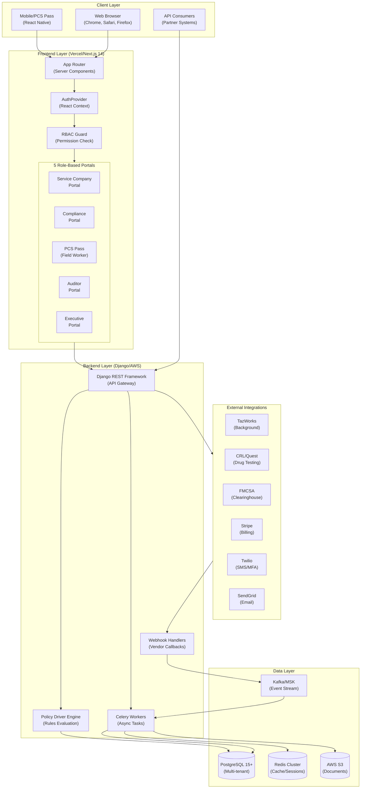
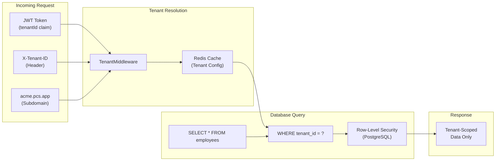
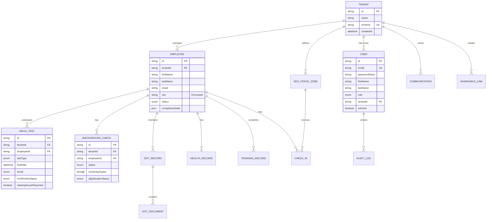
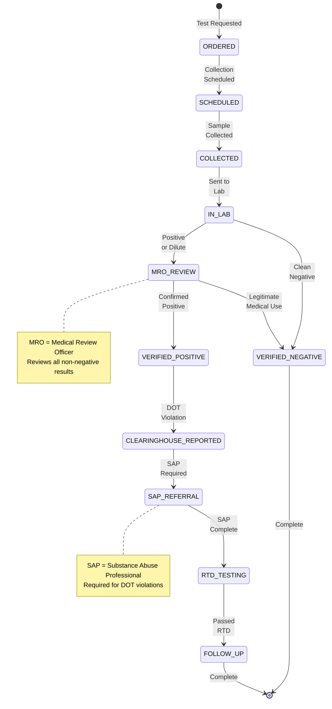
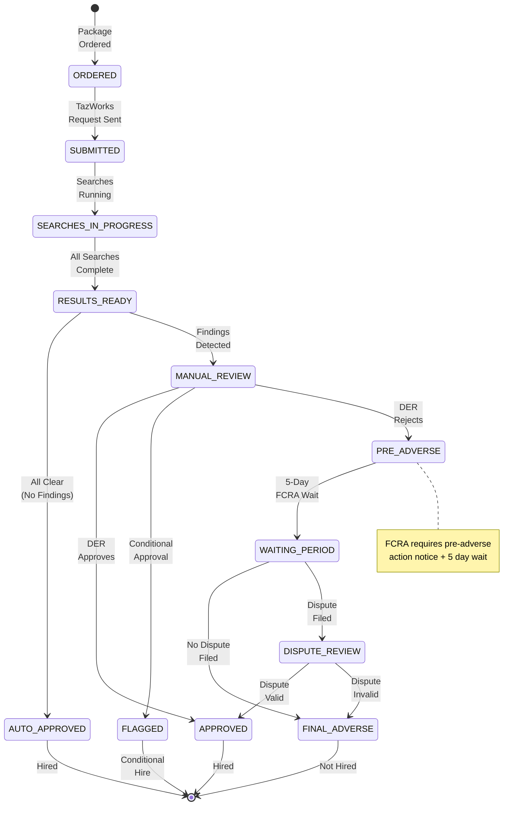
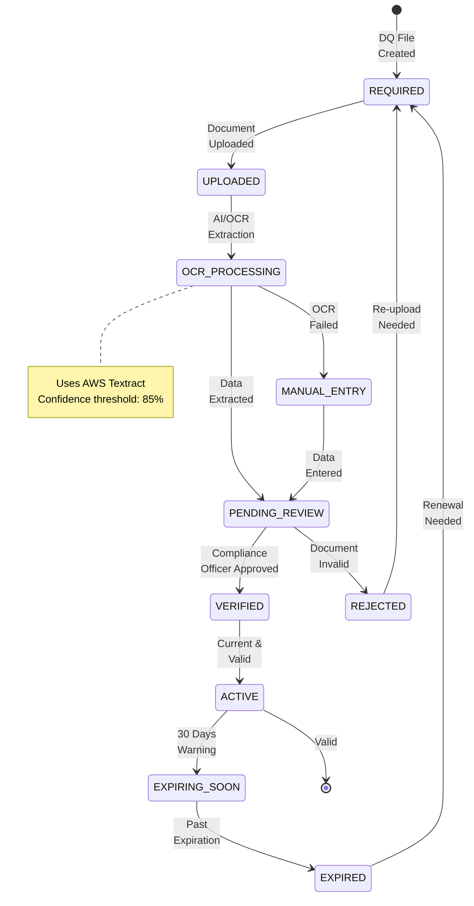
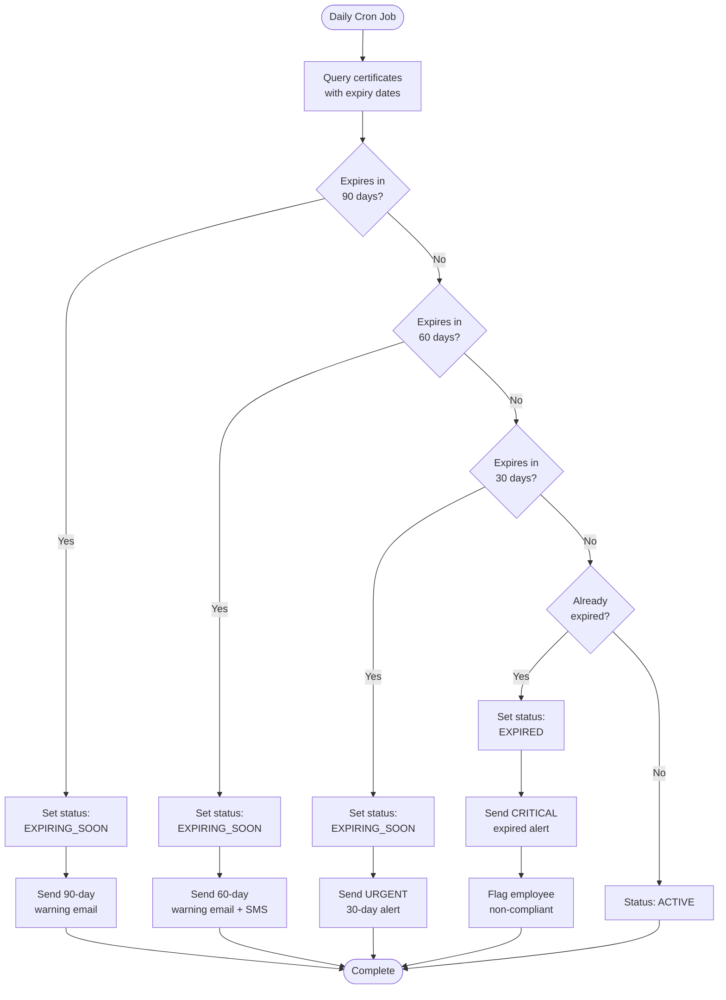
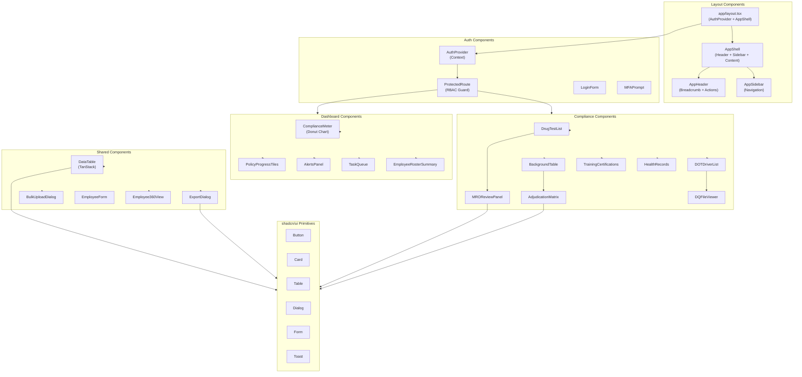

# Patriot Compliance Systems - Visual Architecture Atlas

**Version:** 3.0 | **Last Updated:** November 2025 | **For:** Multi-Million Dollar Compliance Clients

---

## Table of Contents

1. [System Architecture](#1-system-architecture)
2. [Multi-Tenant Data Flow](#2-multi-tenant-data-flow)
3. [RBAC Permission Hierarchy](#3-rbac-permission-hierarchy)
4. [Compliance Module Workflows](#4-compliance-module-workflows)
5. [API Surface Catalog](#5-api-surface-catalog)
6. [Database Schema (ER Diagram)](#6-database-schema-er-diagram)
7. [Portal Navigation Map](#7-portal-navigation-map)
8. [Integration Landscape](#8-integration-landscape)
9. [Development Roadmap](#9-development-roadmap)
10. [Component Dependency Graph](#10-component-dependency-graph)

---

## 1. System Architecture

### 1.1 High-Level System Architecture



### 1.2 Universal Compliance Event Pattern

```
┌─────────────────────────────────────────────────────────────────────────────┐
│                     UNIVERSAL COMPLIANCE EVENT FLOW                          │
├─────────────────────────────────────────────────────────────────────────────┤
│                                                                              │
│  Vendor Webhook ──► API Gateway ──► Kafka Topic ──► Worker Processing       │
│         │                                                   │                │
│         │              ┌────────────────────────────────────┘                │
│         │              │                                                     │
│         │              ▼                                                     │
│         │    Policy Driver Evaluation                                        │
│         │              │                                                     │
│         │              ▼                                                     │
│         │    Employee.complianceData Update                                  │
│         │              │                                                     │
│         │              ▼                                                     │
│         │    Alert Generation (Red/Yellow/Green)                             │
│         │              │                                                     │
│         │              ▼                                                     │
│         └───► Dashboard Refresh (TanStack Query)                             │
│                                                                              │
└─────────────────────────────────────────────────────────────────────────────┘
```

**All 6 compliance modules follow this identical pattern:**

- Drug & Alcohol Testing
- Background Screening
- DOT Driver Qualification
- Occupational Health
- Training & Certifications
- Geo-Fencing Check-ins

---

## 2. Multi-Tenant Data Flow

### 2.1 Tenant Isolation Architecture



### 2.2 Data Model Overview



---

## 3. RBAC Permission Hierarchy

### 3.1 Role Hierarchy Pyramid

```
┌─────────────────────────────────────────────────────────────────────────────┐
│                          RBAC PERMISSION PYRAMID                             │
├─────────────────────────────────────────────────────────────────────────────┤
│                                                                              │
│                         ┌───────────────────┐                                │
│                         │   SUPER_ADMIN     │  PCS Internal Only             │
│                         │ Cross-tenant      │  All 42 permissions            │
│                         │ Hardware MFA      │  Audit everything              │
│                         └─────────┬─────────┘                                │
│                                   │                                          │
│             ┌─────────────────────┼─────────────────────┐                    │
│             │                     │                     │                    │
│     ┌───────▼───────┐     ┌───────▼───────┐     ┌───────▼───────┐           │
│     │  SYSTEM_ADMIN │     │COMPLIANCE_    │     │    DER        │           │
│     │  (Tenant)     │     │  OFFICER      │     │ (Designated   │           │
│     │  Full tenant  │     │ Cross-company │     │  Employer     │           │
│     │  management   │     │ compliance    │     │  Rep)         │           │
│     └───────┬───────┘     └───────────────┘     └───────┬───────┘           │
│             │                                           │                    │
│     ┌───────▼───────┐                           ┌───────▼───────┐           │
│     │SAFETY_MANAGER │                           │   AUDITOR     │           │
│     │  Read + Write │                           │  Read-only    │           │
│     │  Own company  │                           │  Evidence     │           │
│     └───────┬───────┘                           └───────────────┘           │
│             │                                                                │
│     ┌───────▼───────┐                                                       │
│     │ FIELD_WORKER  │  PCS Pass Portal                                      │
│     │  Own records  │  Self-service only                                    │
│     │  Check-in     │  ID.me verified                                       │
│     └───────────────┘                                                       │
│                                                                              │
└─────────────────────────────────────────────────────────────────────────────┘
```

### 3.2 Complete Permission Matrix (42 Permissions × 7 Roles)

| Permission                    | super_admin | system_admin | der | safety_manager | compliance_officer | field_worker | auditor |
| :---------------------------- | :---------: | :----------: | :-: | :------------: | :----------------: | :----------: | :-----: |
| **Dashboard**                 |
| dashboard:read                |      ✓      |      ✓       |  ✓  |       ✓        |         ✓          |      ✓       |    ✓    |
| dashboard:write               |      ✓      |      ✓       |  ✓  |       -        |         -          |      -       |    -    |
| **Employees**                 |
| employees:read                |      ✓      |      ✓       |  ✓  |       ✓        |         ✓          |      -       |    ✓    |
| employees:write               |      ✓      |      ✓       |  ✓  |       ✓        |         -          |      -       |    -    |
| employees:delete              |      ✓      |      ✓       |  -  |       -        |         -          |      -       |    -    |
| employees:export              |      ✓      |      ✓       |  ✓  |       ✓        |         -          |      -       |    -    |
| employees:own                 |      ✓      |      ✓       |  ✓  |       ✓        |         ✓          |      ✓       |    ✓    |
| **Drug Testing**              |
| drug-testing:read             |      ✓      |      ✓       |  ✓  |       ✓        |         ✓          |      -       |    ✓    |
| drug-testing:write            |      ✓      |      ✓       |  ✓  |       ✓        |         ✓          |      -       |    -    |
| drug-testing:delete           |      ✓      |      ✓       |  -  |       -        |         -          |      -       |    -    |
| drug-testing:export           |      ✓      |      ✓       |  ✓  |       ✓        |         ✓          |      -       |    ✓    |
| drug-testing:own              |      ✓      |      ✓       |  ✓  |       ✓        |         ✓          |      ✓       |    ✓    |
| **Background Checks**         |
| background:read               |      ✓      |      ✓       |  ✓  |       ✓        |         ✓          |      -       |    ✓    |
| background:write              |      ✓      |      ✓       |  ✓  |       -        |         ✓          |      -       |    -    |
| background:delete             |      ✓      |      ✓       |  -  |       -        |         -          |      -       |    -    |
| background:export             |      ✓      |      ✓       |  ✓  |       -        |         ✓          |      -       |    -    |
| background:own                |      ✓      |      ✓       |  ✓  |       ✓        |         ✓          |      ✓       |    ✓    |
| **DOT Compliance**            |
| dot:read                      |      ✓      |      ✓       |  ✓  |       ✓        |         ✓          |      -       |    ✓    |
| dot:write                     |      ✓      |      ✓       |  ✓  |       -        |         ✓          |      -       |    -    |
| dot:delete                    |      ✓      |      ✓       |  -  |       -        |         -          |      -       |    -    |
| dot:export                    |      ✓      |      ✓       |  ✓  |       -        |         ✓          |      -       |    ✓    |
| dot:own                       |      ✓      |      ✓       |  ✓  |       ✓        |         ✓          |      ✓       |    ✓    |
| **Occupational Health**       |
| health:read                   |      ✓      |      ✓       |  ✓  |       ✓        |         ✓          |      -       |    ✓    |
| health:write                  |      ✓      |      ✓       |  ✓  |       ✓        |         -          |      -       |    -    |
| health:delete                 |      ✓      |      ✓       |  -  |       -        |         -          |      -       |    -    |
| health:export                 |      ✓      |      ✓       |  ✓  |       ✓        |         -          |      -       |    ✓    |
| health:own                    |      ✓      |      ✓       |  ✓  |       ✓        |         ✓          |      ✓       |    ✓    |
| **Training & Certifications** |
| training:read                 |      ✓      |      ✓       |  ✓  |       ✓        |         ✓          |      -       |    ✓    |
| training:write                |      ✓      |      ✓       |  ✓  |       ✓        |         -          |      -       |    -    |
| training:delete               |      ✓      |      ✓       |  -  |       -        |         -          |      -       |    -    |
| training:export               |      ✓      |      ✓       |  ✓  |       ✓        |         -          |      -       |    ✓    |
| training:own                  |      ✓      |      ✓       |  ✓  |       ✓        |         ✓          |      ✓       |    ✓    |
| **Billing**                   |
| billing:read                  |      ✓      |      ✓       |  ✓  |       -        |         -          |      -       |    -    |
| billing:write                 |      ✓      |      ✓       |  -  |       -        |         -          |      -       |    -    |
| billing:delete                |      ✓      |      -       |  -  |       -        |         -          |      -       |    -    |
| billing:export                |      ✓      |      -       |  -  |       -        |         -          |      -       |    -    |
| **Policy Driver**             |
| policy-driver:read            |      ✓      |      ✓       |  ✓  |       ✓        |         ✓          |      -       |    ✓    |
| policy-driver:write           |      ✓      |      ✓       |  ✓  |       -        |         -          |      -       |    -    |
| **Audit Logs**                |
| audit-logs:read               |      ✓      |      ✓       |  ✓  |       ✓        |         ✓          |      -       |    ✓    |
| **Settings**                  |
| settings:read                 |      ✓      |      ✓       |  ✓  |       -        |         -          |      -       |    -    |
| settings:write                |      ✓      |      ✓       |  -  |       -        |         -          |      -       |    -    |

**Permission Legend:**

- ✓ = Full access
- `-` = No access
- `:own` = Access to own records only (self-service)

### 3.3 Portal Access Matrix

| Portal              | super_admin | system_admin | der | safety_manager | compliance_officer | field_worker | auditor |
| :------------------ | :---------: | :----------: | :-: | :------------: | :----------------: | :----------: | :-----: |
| Service Company (/) |      ✓      |      ✓       |  ✓  |       ✓        |         -          |      -       |    -    |
| Compliance Portal   |      ✓      |      -       |  -  |       -        |         ✓          |      -       |    -    |
| PCS Pass            |      -      |      -       |  -  |       -        |         -          |      ✓       |    -    |
| Auditor Portal      |      ✓      |      -       |  -  |       -        |         -          |      -       |    ✓    |
| Executive Portal    |      ✓      |      ✓       |  ✓  |       -        |         -          |      -       |    -    |

---

## 4. Compliance Module Workflows

### 4.1 Drug Testing Module - State Machine



### 4.2 Background Check Module - Adjudication Flow



### 4.3 DOT Driver Qualification - Document Lifecycle



### 4.4 Training & Certifications - Expiration Alert Flow



---

## 5. API Surface Catalog

### 5.1 API Endpoints by Module (29 Total)

| Module                  | Endpoint                             | Methods            | Auth           | Description             |
| :---------------------- | :----------------------------------- | :----------------- | :------------- | :---------------------- |
| **Authentication**      |
|                         | `/api/auth/login`                    | POST               | Public         | Email + password login  |
|                         | `/api/auth/mfa`                      | POST               | Session        | MFA verification        |
|                         | `/api/auth/logout`                   | POST               | JWT            | Session termination     |
| **Employees**           |
|                         | `/api/employees`                     | GET, POST          | JWT            | List/create employees   |
|                         | `/api/employees/[id]`                | GET, PATCH, DELETE | JWT            | Single employee CRUD    |
|                         | `/api/employees/bulk-upload`         | POST               | JWT            | Bulk CSV import         |
|                         | `/api/employees/export`              | GET                | JWT            | Export to CSV/PDF       |
| **Drug Testing**        |
|                         | `/api/drug-testing/tests`            | GET, POST          | JWT            | Test management         |
|                         | `/api/drug-testing/mro-review`       | GET, POST          | JWT            | MRO review workflow     |
|                         | `/api/drug-testing/random-selection` | POST               | JWT            | Random pool selection   |
|                         | `/api/drug-testing/clearinghouse`    | GET, POST          | JWT            | FMCSA reporting         |
| **Background Checks**   |
|                         | `/api/background/screenings`         | GET, POST          | JWT            | Order screenings        |
|                         | `/api/background/adjudication`       | GET, POST          | JWT            | Adjudication decisions  |
|                         | `/api/background/adverse-action`     | GET, POST          | JWT            | Adverse action workflow |
| **DOT Compliance**      |
|                         | `/api/dot/drivers`                   | GET, POST          | JWT            | Driver roster           |
|                         | `/api/dot/documents`                 | GET, POST          | JWT            | DQ file documents       |
|                         | `/api/dot/clearinghouse`             | GET, POST          | JWT            | Clearinghouse queries   |
| **Occupational Health** |
|                         | `/api/health/surveillance`           | GET, POST          | JWT            | Health surveillance     |
|                         | `/api/health/osha-300`               | GET, POST          | JWT            | OSHA 300 logging        |
| **Training**            |
|                         | `/api/training/certificates`         | GET, POST          | JWT            | Certificate management  |
|                         | `/api/training/matrix`               | GET                | JWT            | Training requirements   |
| **Geo-Fencing**         |
|                         | `/api/geo-fencing/zones`             | GET, POST          | JWT            | Zone management         |
|                         | `/api/geo-fencing/check-in`          | POST               | JWT            | Employee check-in       |
|                         | `/api/geo-fencing/triggers`          | POST               | JWT            | Compliance triggers     |
| **Secure Sharing**      |
|                         | `/api/share/create`                  | POST               | JWT            | Create secure link      |
|                         | `/api/share/[token]`                 | POST, DELETE       | Token+Password | Access/revoke link      |
| **Webhooks**            |
|                         | `/api/webhooks/tazworks`             | POST               | Signature      | Background results      |
|                         | `/api/webhooks/drug-testing`         | POST               | Signature      | Drug test results       |
| **AI Assistant**        |
|                         | `/api/der-iq/chat`                   | POST               | JWT            | DER IQ assistant        |

### 5.2 API Response Format

```typescript
// Standard API Response Envelope
interface APIResponse<T> {
  success: boolean
  data?: T
  error?: {
    code: string
    message: string
    details?: Record<string, string[]>
  }
  meta?: {
    page: number
    pageSize: number
    total: number
    totalPages: number
  }
}

// Example: GET /api/employees
{
  "success": true,
  "data": [
    {
      "id": "cuid_xxx",
      "firstName": "John",
      "lastName": "Doe",
      "status": "ACTIVE",
      "complianceData": {
        "drugTest": { "status": "green", "lastDate": "2025-10-01" },
        "background": { "status": "green", "result": "APPROVED" },
        "dot": { "status": "yellow", "medCardExpires": "2025-12-15" }
      }
    }
  ],
  "meta": {
    "page": 1,
    "pageSize": 20,
    "total": 156,
    "totalPages": 8
  }
}
```

---

## 6. Database Schema (ER Diagram)

### 6.1 Full Entity Relationship Diagram

```mermaid
erDiagram
    tenants ||--o{ users : "has"
    tenants ||--o{ employees : "manages"
    tenants ||--o{ geo_fence_zones : "defines"
    tenants ||--o{ communications : "sends"
    tenants ||--o{ shareable_links : "creates"

    employees ||--o{ drug_tests : "has"
    employees ||--o{ background_checks : "has"
    employees ||--o{ dot_records : "has"
    employees ||--o{ health_records : "has"
    employees ||--o{ training_records : "has"
    employees ||--o{ check_ins : "logs"

    dot_records ||--o{ dot_documents : "contains"
    geo_fence_zones ||--o{ check_ins : "receives"
    users ||--o{ audit_logs : "creates"

    tenants {
        string id PK "cuid()"
        string name "Company name"
        string schema UK "Unique schema identifier"
        datetime createdAt
        datetime updatedAt
    }

    users {
        string id PK "cuid()"
        string email UK
        string passwordHash "Nullable for SSO"
        string firstName
        string lastName
        UserRole role "ENUM"
        string tenantId FK
        boolean isActive "Default: true"
        datetime lastLoginAt
        datetime createdAt
        datetime updatedAt
    }

    employees {
        string id PK "cuid()"
        string tenantId FK "Required for isolation"
        string firstName
        string lastName
        string email "Nullable"
        string phone "Nullable"
        string ssn "Encrypted AES-256"
        datetime dateOfBirth
        datetime hireDate
        datetime terminationDate "Nullable"
        EmployeeStatus status "ENUM"
        string jobTitle
        string department
        string location
        json complianceData "JSONB rollup"
        datetime createdAt
        datetime updatedAt
    }

    drug_tests {
        string id PK "cuid()"
        string tenantId FK
        string employeeId FK
        DrugTestType testType "ENUM"
        datetime testDate
        string collectionSite
        string donorId
        string specimenId
        TestResult result "ENUM"
        MROStatus mroReviewStatus "ENUM"
        datetime mroReviewDate
        string mroNotes
        string vendorId "CRL, Quest, etc."
        string vendorTestId
        boolean clearinghouseReported "Default: false"
        datetime createdAt
        datetime updatedAt
    }

    background_checks {
        string id PK "cuid()"
        string tenantId FK
        string employeeId FK
        datetime orderDate
        datetime completionDate
        BackgroundCheckStatus status "ENUM"
        string[] screeningTypes "Array"
        string overallResult
        AdjudicationStatus adjudicationStatus "ENUM"
        datetime adjudicationDate
        string adjudicationNotes
        string vendorId "TazWorks"
        string vendorOrderId
        boolean continuousMonitoring "Default: false"
        datetime createdAt
        datetime updatedAt
    }

    dot_records {
        string id PK "cuid()"
        string tenantId FK
        string employeeId FK
        string driverLicenseNumber
        string driverLicenseState
        datetime driverLicenseExpiry
        datetime medicalCertExpiry
        string medicalCertStatus
        boolean clearinghouseConsent "Default: false"
        datetime clearinghouseLastQuery
        string dqFileUrl
        datetime createdAt
        datetime updatedAt
    }

    dot_documents {
        string id PK "cuid()"
        string tenantId FK
        string dotRecordId FK
        DOTDocumentType documentType "ENUM"
        string fileName
        string fileUrl "S3 signed URL"
        datetime uploadDate
        datetime expiryDate
        string status
        json ocrData "OCR extracted data"
        datetime createdAt
        datetime updatedAt
    }

    health_records {
        string id PK "cuid()"
        string tenantId FK
        string employeeId FK
        HealthRecordType recordType "ENUM"
        datetime recordDate
        string provider
        string result
        string workAccommodations
        datetime expiryDate
        string vendorId "Quest"
        string vendorRecordId
        datetime createdAt
        datetime updatedAt
    }

    training_records {
        string id PK "cuid()"
        string tenantId FK
        string employeeId FK
        string certificateType
        string certificateNumber
        datetime issueDate
        datetime expiryDate
        string issuingAuthority
        string fileUrl
        json ocrData "OCR extracted data"
        CertificateStatus status "ENUM"
        datetime createdAt
        datetime updatedAt
    }

    audit_logs {
        string id PK "cuid()"
        string tenantId FK
        string userId FK
        string action "CREATE, UPDATE, DELETE, etc."
        string resource "employees, drug_tests, etc."
        string resourceId
        json details "Change details"
        string ipAddress
        string userAgent
        string result "SUCCESS, FAILURE"
        datetime createdAt
    }

    geo_fence_zones {
        string id PK "cuid()"
        string tenantId FK
        string name
        ZoneType type "ENUM"
        json coordinates "GeoJSON for PostGIS"
        json complianceRequirements
        datetime createdAt
        datetime updatedAt
    }

    check_ins {
        string id PK "cuid()"
        string tenantId FK
        string employeeId FK
        string zoneId FK
        datetime checkInTime
        datetime checkOutTime
        float latitude
        float longitude
        CheckInMethod method "ENUM"
        datetime createdAt
    }

    communications {
        string id PK "cuid()"
        string tenantId FK
        string subject
        string message
        string[] channels "EMAIL, SMS, PUSH"
        Priority priority "ENUM"
        datetime scheduledFor
        datetime sentAt
        int recipientCount
        int deliveredCount
        int readCount
        int failedCount
        string createdBy FK
        datetime createdAt
    }

    shareable_links {
        string id PK "cuid()"
        string tenantId FK
        string token UK
        string resourceType
        string resourceId
        string passwordHash
        datetime expiresAt
        boolean oneTimeUse "Default: false"
        int accessCount "Default: 0"
        datetime lastAccessedAt
        string lastAccessedIp
        string createdBy FK
        datetime createdAt
    }
```



### 6.2 Enum Definitions

```typescript
// User Roles
enum UserRole {
  SUPER_ADMIN           // PCS Internal
  EXECUTIVE             // Client C-Suite
  COMPLIANCE_OFFICER    // Cross-company compliance
  SERVICE_COMPANY_ADMIN // Full company access
  SERVICE_COMPANY_USER  // Read-only company
  FIELD_WORKER          // PCS Pass (self-service)
  AUDITOR               // Read-only evidence
}

// Employee Status
enum EmployeeStatus {
  ACTIVE
  INACTIVE
  TERMINATED
  ON_LEAVE
}

// Drug Test Types
enum DrugTestType {
  PRE_EMPLOYMENT
  RANDOM
  POST_ACCIDENT
  REASONABLE_SUSPICION
  RETURN_TO_DUTY
  FOLLOW_UP
}

// Test Results
enum TestResult {
  NEGATIVE
  POSITIVE
  DILUTE
  INVALID
  CANCELLED
  PENDING
}

// MRO Status
enum MROStatus {
  PENDING_REVIEW
  VERIFIED_NEGATIVE
  VERIFIED_POSITIVE
  TEST_CANCELLED
}

// Background Check Status
enum BackgroundCheckStatus {
  PENDING
  IN_PROGRESS
  COMPLETED
  CANCELLED
}

// Adjudication Status
enum AdjudicationStatus {
  PENDING
  APPROVED
  DENIED
  CONDITIONAL
}

// DOT Document Types
enum DOTDocumentType {
  DRIVER_APPLICATION
  MOTOR_VEHICLE_RECORD
  ROAD_TEST
  MEDICAL_CERTIFICATE
  PREVIOUS_EMPLOYER_VERIFICATION
  ANNUAL_REVIEW
  CLEARINGHOUSE_QUERY
  VIOLATION_RECORD
}

// Health Record Types
enum HealthRecordType {
  PHYSICAL_EXAM
  HEARING_TEST
  RESPIRATOR_FIT_TEST
  IMMUNIZATION
  DRUG_SCREEN
  INJURY_REPORT
}

// Certificate Status
enum CertificateStatus {
  ACTIVE
  EXPIRED
  EXPIRING_SOON
  REVOKED
}

// Geo-Fence Zone Types
enum ZoneType {
  STATE
  COUNTY
  CITY
  SITE
}

// Check-In Methods
enum CheckInMethod {
  GPS
  QR_CODE
  MANUAL
}

// Communication Priority
enum Priority {
  LOW
  NORMAL
  HIGH
  URGENT
}
```

---

## 7. Portal Navigation Map

### 7.1 Complete Route Structure

```
PCS Platform (97 Pages)
│
├── Authentication Routes (app/(auth)/)
│   ├── /login                           # Multi-portal login
│   ├── /mfa-challenge                   # MFA verification
│   ├── /forgot-password                 # Password reset
│   ├── /onboarding                      # Portal selection wizard
│   ├── /403                             # Unauthorized access
│   └── /account-locked                  # Account lockout
│
├── Service Company Portal (/)           # Primary business portal
│   ├── /dashboard                       # Compliance overview
│   │   ├── Compliance meter widget
│   │   ├── Policy progress tiles
│   │   ├── Alerts panel
│   │   └── Task queue
│   │
│   ├── /employees                       # Employee management
│   │   ├── /employees                   # Roster table
│   │   ├── /employees/[id]              # 360° employee view
│   │   └── Bulk upload modal
│   │
│   ├── /compliance                      # Compliance modules
│   │   ├── /compliance/drug-testing     # Drug & alcohol
│   │   ├── /compliance/background       # Background checks
│   │   ├── /compliance/dot              # DOT compliance
│   │   │   └── /compliance/dot/drivers/[id]  # Driver detail
│   │   ├── /compliance/health           # Occupational health
│   │   ├── /compliance/training         # Training & certs
│   │   └── /compliance/hipaa-privacy    # HIPAA controls
│   │
│   ├── /geo-fencing                     # Location compliance
│   │   ├── Map view tab
│   │   ├── Zones management tab
│   │   ├── Triggers tab
│   │   └── Check-ins history tab
│   │
│   ├── /communications                  # Messaging center
│   │   └── Compose/history view
│   │
│   ├── /billing                         # Financial management
│   │   └── Invoices, payments, usage
│   │
│   ├── /reports                         # Reporting & analytics
│   │   ├── /reports                     # Report builder
│   │   └── /reports/mis-express         # MIS Express reports
│   │
│   ├── /audit-logs                      # Audit trail
│   │   └── Filterable log viewer
│   │
│   ├── /policy-driver                   # Policy configuration
│   │   ├── Rule editor
│   │   ├── Simulation mode
│   │   └── Policy templates
│   │
│   ├── /settings                        # System settings
│   │   ├── Company info tab
│   │   ├── User management tab
│   │   ├── Policy config tab
│   │   ├── Notifications tab
│   │   ├── Integrations tab
│   │   ├── Demo mode tab
│   │   └── /settings/shareable-links    # Secure link management
│   │
│   └── /integrations
│       └── /integrations/workforce      # Workforce.com connector
│
├── Compliance Portal (/compliance-portal)  # MSP oversight portal
│   ├── /compliance-portal               # Portfolio overview
│   ├── /compliance-portal/portfolio     # All companies view
│   ├── /compliance-portal/alerts        # Cross-company alerts
│   │
│   └── /compliance-portal/[companySlug] # Per-company views
│       ├── /employees
│       ├── /drug-testing
│       ├── /background
│       ├── /dot
│       ├── /training
│       ├── /reports
│       └── /billing
│
├── PCS Pass Portal (/portals/pcs-pass)  # Field worker self-service
│   ├── /portals/pcs-pass                # Status dashboard
│   ├── /portals/pcs-pass/documents      # My documents
│   ├── /portals/pcs-pass/check-in       # Geo check-in
│   ├── /portals/pcs-pass/drug-testing   # My test history
│   ├── /portals/pcs-pass/notifications  # My alerts
│   └── /portals/pcs-pass/profile        # Profile settings
│
├── Executive Portal (/portals/executive) # C-Suite dashboard
│   └── KPIs, analytics, exports
│
├── Auditor Portal (/portals/auditor)    # Evidence repository
│   └── Audit trail, evidence export
│
├── Secure Share (/share)
│   └── /share/[token]                   # Password-protected access
│
├── Onboarding (/onboarding)
│   └── /onboarding/requirements         # Requirements matrix
│
└── API Routes (app/api/)                # 29 API endpoints
    ├── /api/auth/*
    ├── /api/employees/*
    ├── /api/drug-testing/*
    ├── /api/background/*
    ├── /api/dot/*
    ├── /api/health/*
    ├── /api/training/*
    ├── /api/geo-fencing/*
    ├── /api/share/*
    ├── /api/webhooks/*
    └── /api/der-iq/*
```

---

## 8. Integration Landscape

### 8.1 Vendor Integration Map

```mermaid
flowchart TB
    subgraph PCS["Patriot Compliance Systems"]
        Core["Core Platform"]
        WebhookHandler["Webhook Handler"]
        OutboundAPI["Outbound API Client"]
    end

    subgraph Identity["Identity & Auth"]
        IDme["ID.me<br/>(Identity Proofing)"]
        Okta["Okta/Azure AD<br/>(Enterprise SSO)"]
        Twilio["Twilio Verify<br/>(SMS MFA)"]
    end

    subgraph Background["Background Screening"]
        TazWorks["TazWorks<br/>(Primary)"]
        Accurate["Accurate<br/>(Backup)"]
        Checkr["Checkr<br/>(High-Volume)"]
    end

    subgraph DrugTest["Drug Testing"]
        CRL["CRL Labs<br/>(Primary)"]
        Quest["Quest Diagnostics"]
        FormFox["FormFox<br/>(Collection)"]
    end

    subgraph DOT["DOT/Government"]
        FMCSA["FMCSA<br/>(Clearinghouse)"]
        CDLIS["CDLIS<br/>(License Verify)"]
        DMV["State DMV APIs"]
    end

    subgraph Financial["Financial"]
        Stripe["Stripe<br/>(Payments)"]
        Plaid["Plaid<br/>(Bank Verify)"]
        QuickBooks["QuickBooks<br/>(Accounting)"]
    end

    subgraph Comms["Communications"]
        SendGrid["SendGrid<br/>(Email)"]
        TwilioSMS["Twilio<br/>(SMS)"]
        Slack["Slack/Teams<br/>(Alerts)"]
    end

    subgraph HRIS["Workforce/HRIS"]
        Workforce["Workforce.com"]
        UKG["UKG"]
        ADP["ADP"]
    end

    subgraph Storage["Cloud Storage"]
        S3["AWS S3<br/>(Documents)"]
        Textract["AWS Textract<br/>(OCR)"]
    end

    Core --> OutboundAPI
    WebhookHandler --> Core

    OutboundAPI --> IDme
    OutboundAPI --> Okta
    OutboundAPI --> Twilio

    OutboundAPI --> TazWorks
    TazWorks --> WebhookHandler
    OutboundAPI --> Accurate
    Accurate --> WebhookHandler

    OutboundAPI --> CRL
    CRL --> WebhookHandler
    OutboundAPI --> Quest

    OutboundAPI --> FMCSA
    OutboundAPI --> CDLIS
    OutboundAPI --> DMV

    OutboundAPI --> Stripe
    OutboundAPI --> Plaid
    OutboundAPI --> QuickBooks

    OutboundAPI --> SendGrid
    OutboundAPI --> TwilioSMS
    OutboundAPI --> Slack

    OutboundAPI --> Workforce
    Workforce --> WebhookHandler

    OutboundAPI --> S3
    OutboundAPI --> Textract
```



### 8.2 Integration Details Table

| Domain             | Vendor              | Type           | Auth Method         | Data Flow             |
| :----------------- | :------------------ | :------------- | :------------------ | :-------------------- |
| **Identity**       |
|                    | ID.me               | REST API       | OAuth2              | Outbound verification |
|                    | Okta/Azure AD       | SAML/OIDC      | Federation          | SSO tokens            |
|                    | Twilio Verify       | REST API       | API Key             | OTP delivery          |
| **Background**     |
|                    | TazWorks            | REST + Webhook | API Key + Signature | Bidirectional         |
|                    | Accurate            | REST + Webhook | API Key             | Bidirectional         |
| **Drug Testing**   |
|                    | CRL Labs            | ECCF Format    | API Key             | Webhook inbound       |
|                    | Quest Diagnostics   | REST API       | OAuth2              | Bidirectional         |
|                    | FormFox             | REST API       | API Key             | Outbound orders       |
| **DOT/Government** |
|                    | FMCSA Clearinghouse | REST API       | DOT PIN             | Queries + Reports     |
|                    | CDLIS               | SOAP           | State credentials   | Outbound queries      |
| **Financial**      |
|                    | Stripe              | REST + Webhook | API Key             | Payments + Events     |
|                    | Plaid               | REST API       | API Key             | Bank verification     |
|                    | QuickBooks          | REST API       | OAuth2              | Invoice sync          |
| **Communications** |
|                    | SendGrid            | REST API       | API Key             | Email delivery        |
|                    | Twilio SMS          | REST API       | Account SID         | SMS delivery          |
|                    | Slack               | REST API       | OAuth2              | Alert webhooks        |
| **HRIS**           |
|                    | Workforce.com       | REST + Webhook | OAuth2              | Employee sync         |
|                    | UKG                 | REST API       | API Key             | Employee sync         |
| **Storage**        |
|                    | AWS S3              | SDK            | IAM Role            | Document storage      |
|                    | AWS Textract        | SDK            | IAM Role            | OCR processing        |

---

## 9. Development Roadmap

### 9.1 12-15 Month Timeline

```
┌─────────────────────────────────────────────────────────────────────────────┐
│                    PATRIOT COMPLIANCE SYSTEMS ROADMAP                        │
│                         12-15 Month Development Plan                         │
├─────────────────────────────────────────────────────────────────────────────┤
│                                                                              │
│  PHASE 1: FOUNDATION (Months 1-2)                                           │
│  ├─────────────────────────────────────────────────────┤                    │
│  │ ■ PostgreSQL schema + partitioning                   │                    │
│  │ ■ Kafka cluster (AWS MSK)                            │                    │
│  │ ■ Redis cache setup                                  │                    │
│  │ ■ S3 + HIPAA encryption                              │                    │
│  │ ■ CI/CD pipeline                                     │                    │
│  │ ■ Kubernetes (EKS) cluster                           │                    │
│  └─────────────────────────────────────────────────────┘                    │
│                                                                              │
│  PHASE 2: CORE ENGINE (Months 3-4)                                          │
│  ├─────────────────────────────────────────────────────┤                    │
│  │ ■ Kafka consumers + idempotency                      │                    │
│  │ ■ Document parser (ECCF, OCR)                        │                    │
│  │ ■ Compliance validation engine                       │                    │
│  │ ■ Policy service (CRUD + evaluation)                 │                    │
│  │ ■ Dashboard layout + employee roster                 │                    │
│  └─────────────────────────────────────────────────────┘                    │
│                                                                              │
│  PHASE 3: VENDOR ADAPTERS (Months 5-6)                                      │
│  ├─────────────────────────────────────────────────────┤                    │
│  │ ■ CRL/FormFox webhook + ECCF parser                  │                    │
│  │ ■ TazWorks API client + webhook                      │                    │
│  │ ■ File upload with validation                        │                    │
│  │ ■ Random drug test selector (DOT)                    │                    │
│  │ ■ Frontend: document upload, compliance views        │                    │
│  └─────────────────────────────────────────────────────┘                    │
│                                                                              │
│  MVP RELEASE ★ (Month 6)                                                    │
│  ═══════════════════════════════════════════════════════                    │
│                                                                              │
│  PHASE 4: SUPPORTING SERVICES (Months 7-9)                                  │
│  ├─────────────────────────────────────────────────────┤                    │
│  │ ■ Stripe billing integration                         │                    │
│  │ ■ Geo-fencing (PostGIS)                              │                    │
│  │ ■ DER IQ AI assistant (RAG)                          │                    │
│  │ ■ Email/SMS alerting                                 │                    │
│  │ ■ Frontend: billing portal, geo-fence map, DER IQ    │                    │
│  └─────────────────────────────────────────────────────┘                    │
│                                                                              │
│  PHASE 5: MULTI-TENANCY (Months 10-11)                                      │
│  ├─────────────────────────────────────────────────────┤                    │
│  │ ■ Self-service sign-up flow                          │                    │
│  │ ■ Tenant provisioning                                │                    │
│  │ ■ PostgreSQL Row-Level Security                      │                    │
│  │ ■ Role-based dashboards (5 portals)                  │                    │
│  │ ■ User management admin panel                        │                    │
│  └─────────────────────────────────────────────────────┘                    │
│                                                                              │
│  PHASE 6: LAUNCH PREP (Months 12-15)                                        │
│  ├─────────────────────────────────────────────────────┤                    │
│  │ ■ Load testing (10K concurrent users)                │                    │
│  │ ■ Security audit + penetration testing               │                    │
│  │ ■ SOC2 + HIPAA compliance prep                       │                    │
│  │ ■ Playwright E2E test suite                          │                    │
│  │ ■ Documentation + user guides                        │                    │
│  │ ■ Pilot customer onboarding (2 clients)              │                    │
│  └─────────────────────────────────────────────────────┘                    │
│                                                                              │
│  PRODUCTION LAUNCH ★ (Month 15)                                             │
│  ═══════════════════════════════════════════════════════                    │
│                                                                              │
└─────────────────────────────────────────────────────────────────────────────┘
```

### 9.2 Infrastructure Cost Projections

| Scale      | Employees | Monthly Cost   | Annual Cost |
| :--------- | :-------- | :------------- | :---------- |
| Startup    | 0-10K     | $1,320-2,335   | $16K-28K    |
| Growth     | 10K-100K  | $9,695-17,095  | $116K-205K  |
| Enterprise | 100K-1M   | $34,730-59,430 | $417K-713K  |

---

## 10. Component Dependency Graph

### 10.1 React Component Hierarchy



### 10.2 Custom Hooks Dependency

```typescript
// Hook Dependencies
hooks/
├── use-auth.ts              // Depends on: AuthContext
├── use-rbac.ts              // Depends on: use-auth, lib/rbac/permissions
├── use-tenant.ts            // Depends on: use-auth
├── use-compliance-data.ts   // Depends on: use-tenant, use-api
├── use-api.ts               // Depends on: use-auth (for JWT)
├── use-mobile.ts            // Standalone (window.matchMedia)
├── use-toast.ts             // Depends on: Toast context
└── use-der-iq.ts            // Depends on: use-api, use-auth
```

---

## Directory Reference

### Current File Structure

```
pcs-mod/
├── app/                          # Next.js App Router (97 pages)
│   ├── (auth)/                   # Auth routes (login, MFA, onboarding)
│   ├── api/                      # 29 API route handlers
│   ├── compliance/               # 6 compliance module pages
│   ├── compliance-portal/        # MSP portal with [companySlug]
│   ├── portals/                  # PCS Pass, Executive, Auditor
│   ├── dashboard/                # Main dashboard
│   ├── employees/                # Employee management
│   ├── geo-fencing/              # Location compliance
│   ├── reports/                  # Reporting & MIS Express
│   ├── settings/                 # Configuration & shareable links
│   └── share/                    # Secure document sharing
│
├── components/                   # 93+ React components
│   ├── ui/                       # shadcn/ui primitives
│   ├── layout/                   # AppShell, Header, Sidebar
│   ├── auth/                     # ProtectedRoute, RoleSwitcher
│   ├── dashboard/                # Compliance meter, alerts, tiles
│   └── [domain]/                 # Domain-specific components
│
├── hooks/                        # 4 custom hooks
│   ├── use-rbac.ts               # Permission checking
│   ├── use-der-iq.ts             # AI assistant
│   ├── use-mobile.ts             # Responsive detection
│   └── use-toast.ts              # Toast notifications
│
├── lib/                          # Utilities & services
│   ├── auth/                     # Auth context, session, security
│   ├── rbac/                     # Permission matrix (42 permissions)
│   ├── data/                     # Mock data sources
│   ├── ai/                       # DER IQ mock responder
│   └── utils.ts                  # cn(), formatters, helpers
│
├── types/                        # TypeScript definitions
│   ├── auth.ts                   # Auth types
│   └── share.ts                  # Share link types
│
├── prisma/                       # Database schema
│   └── schema.prisma             # 13 models, 17 enums
│
├── specs/                        # Documentation
│   ├── docs.md                   # This file
│   ├── ARCHITECTURE_ASSESSMENT.md
│   └── PLANS.md                  # Implementation timeline
│
└── middleware.ts                 # Route protection (TODO: implement)
```

---

## Next Steps

1. **Replace mock APIs** in `app/api/**` with Prisma-backed services
2. **Enable middleware.ts** route protection with JWT verification
3. **Implement bcrypt** password hashing (replace btoa)
4. **Wire vendor webhooks** to Kafka topics
5. **Deploy AWS infrastructure** per architecture blueprint

---

**Document Version:** 3.0
**Last Updated:** November 2025
**Maintainer:** Engineering Team
