# CRL/FormFox Integration - Simple Guide

---

## The Restaurant Analogy

Think of CRL/FormFox like a **restaurant ordering system**:

| Restaurant | Drug Testing |
|:-----------|:-------------|
| You browse the menu | You search for clinics |
| You place an order | You create a test order |
| You get a receipt/ticket number | You get an authorization form |
| Kitchen prepares food | Clinic collects the sample |
| Food quality check | Lab tests the specimen |
| Manager approval (if issue) | MRO reviews (if non-negative) |
| Server brings your food | Results sent to you |

**Key insight:** You place the order, then wait. The kitchen (CRL) does the work and brings you updates automatically.

---

## What Can CRL/FormFox Do?

### The 6 Things We Can Ask Them To Do

```
┌─────────────────────────────────────────────────────────────────┐
│                    CRL/FORMFOX CAPABILITIES                      │
├─────────────────────────────────────────────────────────────────┤
│                                                                  │
│  1. FIND CLINICS         "Where can my employee go?"            │
│     📍 Search by ZIP code, services needed, distance            │
│                                                                  │
│  2. CREATE ORDER         "Schedule a test for John Smith"       │
│     📝 Employee info + clinic + test type → Order created       │
│                                                                  │
│  3. GET AUTHORIZATION    "Give me the pass to enter"            │
│     🎫 PDF form employee takes to clinic                        │
│                                                                  │
│  4. CHANGE ORDER         "Actually, use a different clinic"     │
│     ✏️  Only works if employee hasn't gone yet                   │
│                                                                  │
│  5. CANCEL ORDER         "Never mind, cancel the test"          │
│     ❌ Only works if employee hasn't gone yet                    │
│                                                                  │
│  6. RECEIVE UPDATES      "Tell me what's happening"             │
│     📬 They automatically send us status & results              │
│                                                                  │
└─────────────────────────────────────────────────────────────────┘
```

---

## Simple Flow Diagrams

### Flow 1: The Happy Path (Everything Goes Smoothly)

**Scenario:** New hire Sarah needs a pre-employment drug test. Result is negative.

```
    YOU                          CRL                         CLINIC/LAB
     │                            │                              │
     │  "Find clinics near 75001" │                              │
     │ ─────────────────────────► │                              │
     │                            │                              │
     │  "Here are 5 clinics"      │                              │
     │ ◄───────────────────────── │                              │
     │                            │                              │
     │  "Test Sarah at Clinic A"  │                              │
     │ ─────────────────────────► │                              │
     │                            │                              │
     │  "OK! Order #12345"        │                              │
     │ ◄───────────────────────── │                              │
     │                            │                              │
     │                            │   Sarah visits with form     │
     │                            │ ────────────────────────────►│
     │                            │                              │
     │  "Sarah checked in"        │                              │
     │ ◄───────────────────────── │ ◄─────────────────────────── │
     │                            │                              │
     │  "Sample collected"        │                              │
     │ ◄───────────────────────── │ ◄─────────────────────────── │
     │                            │                              │
     │  "Lab received specimen"   │                              │
     │ ◄───────────────────────── │                              │
     │                            │                              │
     │  "RESULT: NEGATIVE ✓"      │                              │
     │ ◄───────────────────────── │                              │
     │                            │                              │
    ✅ DONE - Sarah can start work
```

**Timeline:** Usually 2-5 business days from collection to results.

---

### Flow 2: When MRO Review Is Needed

**Scenario:** Driver Mike's test shows something. MRO needs to review.

```
    YOU                          CRL                      MRO (SYNERGY)
     │                            │                              │
     │  (Same steps as above      │                              │
     │   until lab results...)    │                              │
     │                            │                              │
     │  "Lab found something"     │                              │
     │ ◄───────────────────────── │                              │
     │                            │                              │
     │  "Sending to MRO review"   │    "Review this case"        │
     │ ◄───────────────────────── │ ────────────────────────────►│
     │                            │                              │
     │                            │         MRO calls Mike       │
     │                            │         to discuss           │
     │                            │                              │
     │                            │    "Here's my decision"      │
     │  "MRO results ready"       │ ◄──────────────────────────  │
     │ ◄───────────────────────── │                              │
     │                            │                              │
     │  Click link to see results │                              │
     │ ─────────────────────────► │                              │
     │                            │                              │
     │  "VERIFIED NEGATIVE" ✓     │                              │
     │  (Mike had valid Rx)       │                              │
     │ ◄───────────────────────── │                              │
     │                            │                              │
    ✅ DONE - Mike is cleared

         OR

     │  "VERIFIED POSITIVE" ✗     │                              │
     │ ◄───────────────────────── │                              │
     │                            │                              │
    ⚠️  Follow SAP/Clearinghouse process
```

**What MRO does:** A doctor reviews the result, calls the employee to check if they have a legitimate prescription, then makes the final call.

---

### Flow 3: Physical Exam (No Lab Needed)

**Scenario:** Trucker Bob needs his DOT physical.

```
    YOU                          CRL                         CLINIC
     │                            │                              │
     │  "Find clinics for physical"                              │
     │ ─────────────────────────► │                              │
     │                            │                              │
     │  "Here are clinics"        │                              │
     │ ◄───────────────────────── │                              │
     │                            │                              │
     │  "Physical for Bob"        │                              │
     │ ─────────────────────────► │                              │
     │                            │                              │
     │  "OK! Order #67890"        │                              │
     │ ◄───────────────────────── │                              │
     │                            │                              │
     │                            │      Bob visits clinic       │
     │                            │ ────────────────────────────►│
     │                            │                              │
     │                            │      Doctor examines Bob     │
     │                            │                              │
     │  "Physical complete"       │                              │
     │ ◄───────────────────────── │ ◄─────────────────────────── │
     │                            │                              │
     │  "Here's the Medical       │                              │
     │   Exam Report PDF"         │                              │
     │ ◄───────────────────────── │                              │
     │                            │                              │
    ✅ DONE - No lab, no MRO needed
```

**Key difference:** Physicals and breath alcohol tests end at the clinic. No specimen goes to a lab.

---

## Which Tests Go Where?

```
                                    ENDS AT         ENDS AT         ENDS AT
          TEST TYPE                 CLINIC?          LAB?            MRO?
         ─────────────────────────────────────────────────────────────────

         Physical Exam                 ✅              ─               ─
         (DOT or regular)          DONE HERE

         Breath Alcohol               ✅              ─               ─
         (Breathalyzer)            DONE HERE

         Drug Test                    ─              ✅               ─
         (Negative result)                       DONE HERE

         Drug Test                    ─              ─               ✅
         (Needs review)                                          DONE HERE
```

---

## The Authorization Form Explained

```
┌─────────────────────────────────────────────────────────────────┐
│                     AUTHORIZATION FORM                           │
│                     (Like a Movie Ticket)                        │
├─────────────────────────────────────────────────────────────────┤
│                                                                  │
│   WHAT IT IS:                                                    │
│   • A PDF document with a unique number                         │
│   • Employee takes it to the clinic                             │
│   • Clinic scans/enters the number to pull up the order         │
│                                                                  │
│   HOW EMPLOYEE GETS IT:                                         │
│   • Option A: Auto-sent via email when order created            │
│   • Option B: Auto-sent via text message                        │
│   • Option C: You retrieve it and give to them                  │
│                                                                  │
│   WHY IT MATTERS:                                               │
│   • Without it, clinic can't find the order                     │
│   • Prevents mix-ups and duplicate orders                       │
│   • Has all the pre-filled employee info                        │
│                                                                  │
└─────────────────────────────────────────────────────────────────┘
```

---

## What We Send vs. What We Receive

```
        ┌──────────────────────┐              ┌──────────────────────┐
        │    PATRIOT (US)      │              │    CRL/FORMFOX       │
        └──────────┬───────────┘              └──────────┬───────────┘
                   │                                      │
    WE SEND ───────┼──────────────────────────────────────┼───────────
                   │                                      │
                   │  "Find me clinics near ZIP 75001"   │
                   │ ────────────────────────────────────►│
                   │                                      │
                   │  "Create order for employee X"      │
                   │ ────────────────────────────────────►│
                   │                                      │
                   │  "Get the authorization PDF"        │
                   │ ────────────────────────────────────►│
                   │                                      │
                   │  "Change this pending order"        │
                   │ ────────────────────────────────────►│
                   │                                      │
                   │  "Cancel this pending order"        │
                   │ ────────────────────────────────────►│
                   │                                      │
    WE RECEIVE ────┼──────────────────────────────────────┼───────────
                   │                                      │
                   │       "Employee arrived at clinic"  │
                   │ ◄────────────────────────────────────│
                   │                                      │
                   │       "Sample was collected"        │
                   │ ◄────────────────────────────────────│
                   │                                      │
                   │       "Lab received specimen"       │
                   │ ◄────────────────────────────────────│
                   │                                      │
                   │       "Lab is testing"              │
                   │ ◄────────────────────────────────────│
                   │                                      │
                   │       "Here are the results + PDFs" │
                   │ ◄────────────────────────────────────│
                   │                                      │
                   │       "MRO made a decision"         │
                   │ ◄────────────────────────────────────│
                   │                                      │
```

**Key point:** We ask for things (active). They tell us what's happening (automatic updates).

---

## Real-World Example: Pre-Employment Screening

**Situation:** ABC Trucking hires a new driver. They need:
- DOT drug test
- DOT physical
- Breath alcohol test

```
DAY 1 (Monday Morning)
━━━━━━━━━━━━━━━━━━━━━━━━━━━━━━━━━━━━━━━━━━━━━━━━━━━━━━━━━━━━━━━━━

   HR creates order in Patriot system:

   Employee: John Driver
   Services: Drug Test + Physical + Breath Alcohol
   Location: Near ZIP 75201

         │
         ▼

   System finds: "QuickCare Clinic - 3.2 miles away"

         │
         ▼

   Order created → Authorization emailed to John

━━━━━━━━━━━━━━━━━━━━━━━━━━━━━━━━━━━━━━━━━━━━━━━━━━━━━━━━━━━━━━━━━

DAY 1 (Monday Afternoon)
━━━━━━━━━━━━━━━━━━━━━━━━━━━━━━━━━━━━━━━━━━━━━━━━━━━━━━━━━━━━━━━━━

   John visits QuickCare with his authorization

         │
         ▼

   Clinic performs:
   ✓ Breath alcohol test → PASSED (0.00)
   ✓ DOT physical → PASSED
   ✓ Urine collection → Sent to lab

         │
         ▼

   Patriot receives automatic updates:
   📬 "Breath alcohol: NEGATIVE"
   📬 "Physical: PASSED" + PDF certificate
   📬 "Specimen shipped to lab"

━━━━━━━━━━━━━━━━━━━━━━━━━━━━━━━━━━━━━━━━━━━━━━━━━━━━━━━━━━━━━━━━━

DAY 3 (Wednesday)
━━━━━━━━━━━━━━━━━━━━━━━━━━━━━━━━━━━━━━━━━━━━━━━━━━━━━━━━━━━━━━━━━

   Lab completes testing

         │
         ▼

   Patriot receives:
   📬 "Drug test: NEGATIVE"
   📬 Chain of Custody Form (PDF)

━━━━━━━━━━━━━━━━━━━━━━━━━━━━━━━━━━━━━━━━━━━━━━━━━━━━━━━━━━━━━━━━━

RESULT
━━━━━━━━━━━━━━━━━━━━━━━━━━━━━━━━━━━━━━━━━━━━━━━━━━━━━━━━━━━━━━━━━

   ✅ John is cleared to start work

   All results and documents stored in Patriot system
```

---

## Important Rules to Remember

### Rule 1: You Must Search Before Ordering

```
   ❌ WRONG                          ✅ RIGHT

   "Create order for                 "Find clinics near 75201"
    Clinic XYZ"                              │
        │                                    ▼
        ▼                            "Got it - Clinic ABC, ID: 12345"
    ERROR: We don't                          │
    know that clinic                         ▼
                                     "Create order at Clinic 12345"
                                             │
                                             ▼
                                        SUCCESS!
```

### Rule 2: Can Only Change PENDING Orders

```
   ORDER STATUS          CAN CHANGE?      CAN CANCEL?
   ────────────────────────────────────────────────────
   PENDING                   ✅              ✅
   (Employee hasn't
    gone yet)

   ACTIVE                    ❌              ❌
   (Employee at clinic)

   COMPLETED                 ❌              ❌
   (Already done)
```

### Rule 3: One Order = One Employee (But Multiple Tests OK)

```
   ❌ WRONG                          ✅ RIGHT

   Order for:                        Order for:
   • John Smith                      • John Smith
   • Jane Doe                          - Drug test
   • Bob Wilson                        - Physical
                                       - Breath alcohol

   (Must be separate orders)         (All in one order is fine)
```

---

## Common Questions

**Q: How long until we get results?**
- Physicals/Breath Alcohol: Same day (after clinic visit)
- Drug tests (negative): 2-3 business days
- Drug tests (MRO review): 3-7 business days

**Q: Can the employee pick any clinic?**
- Only clinics returned by our search that offer the needed services

**Q: What if the employee doesn't show up?**
- Order stays pending until it expires or you cancel it

**Q: Do we have to keep checking for updates?**
- No! Updates are pushed to us automatically

**Q: Can we pull historical data from CRL?**
- No. We only receive data going forward. We must store it ourselves.

**Q: What's the MRO?**
- Medical Review Officer - a doctor who reviews non-negative results to see if there's a legitimate medical explanation (like a prescription)

---


## 1. Executive Summary

This document details the CRL/FormFox API integration for the Patriot Compliance Systems platform. The integration enables end-to-end drug testing, occupational health services, and compliance workflows through CRL's FormFox Marketplace.

### Integration Contacts
- **Primary Contact:** Victoria Tran (CRL API Integrations)
- **Secondary Contact:** Brent Henderson (CRL API Integrations)

### Key Objectives
- Drug & alcohol testing (DOT and non-DOT)
- Occupational health services (physicals, breath alcohol, fit testing)
- Background checks integration
- Training and certification tracking
- MRO (Medical Review Officer) verified results via Synergy

---

## 2. System Architecture Overview

```
┌─────────────────────────────────────────────────────────────────────────────────────┐
│                         PATRIOT COMPLIANCE SYSTEMS (PCS)                             │
│  ┌─────────────────┐  ┌─────────────────┐  ┌─────────────────┐                      │
│  │ Employee Mgmt   │  │ Order Management│  │ Results Viewer  │                      │
│  │ (TPA Database)  │  │ (Create/Update) │  │ (Dashboard)     │                      │
│  └────────┬────────┘  └────────┬────────┘  └────────▲────────┘                      │
│           │                    │                    │                               │
│           │  ┌─────────────────┴─────────────────┐  │                               │
│           │  │         API INTEGRATION LAYER      │  │                               │
│           │  │  ┌─────────┐ ┌─────────┐ ┌──────┐ │  │                               │
│           │  │  │ Clinic  │ │ Order   │ │Status│ │  │                               │
│           │  │  │ Search  │ │ Create  │ │Listen│ │  │                               │
│           │  │  └────┬────┘ └────┬────┘ └───▲──┘ │  │                               │
│           │  └───────┼──────────┼──────────┼─────┘  │                               │
└───────────┼──────────┼──────────┼──────────┼────────┼───────────────────────────────┘
            │          │          │          │        │
════════════╪══════════╪══════════╪══════════╪════════╪══════ NETWORK BOUNDARY ════════
            │          │          │          │        │
┌───────────┼──────────┼──────────┼──────────┼────────┼───────────────────────────────┐
│           ▼          ▼          ▼          │        │      CRL/FORMFOX SYSTEM       │
│  ┌─────────────────────────────────────────┴────────┴─────────────────────────┐     │
│  │                        CRL API GATEWAY                                      │     │
│  │  • IP Whitelisting (Test Environment Only)                                  │     │
│  │  • Basic Auth (Base64 encoded username:password)                            │     │
│  └─────────────────────────────────────────────────────────────────────────────┘     │
│           │          │          │                   │                               │
│           ▼          ▼          ▼                   │                               │
│  ┌────────────┐ ┌────────────┐ ┌────────────┐      │                               │
│  │ Marketplace│ │  FormFox   │ │  FormFox   │◄─────┘                               │
│  │  Search    │ │   Order    │ │   Results  │    (Push to Listener)                │
│  └────────────┘ └─────┬──────┘ └────────────┘                                       │
│                       │                                                              │
│                       ▼                                                              │
│              ┌────────────────┐     ┌────────────────┐     ┌────────────────┐       │
│              │  COLLECTION    │────▶│      LAB       │────▶│      MRO       │       │
│              │     SITE       │     │   (CRL Lab)    │     │   (Synergy)    │       │
│              └────────────────┘     └────────────────┘     └───────┬────────┘       │
│                                                                     │               │
│                                                                     ▼               │
│                                                            ┌────────────────┐       │
│                                                            │  LDP Webhook   │───────┘
│                                                            │(MRO Verified)  │
│                                                            └────────────────┘
└─────────────────────────────────────────────────────────────────────────────────────┘
```

---

## 3. Complete API Catalog

### 3.1 FormFox Marketplace Clinic Search API

**Purpose:** Search for collection sites/clinics that offer specific services within a geographic radius.

| Attribute | Value |
|:----------|:------|
| **Endpoint** | `POST https://api-clienttest.crlformfox.com/external/FormFoxMarketplaceClinicSearch/Original/` |
| **Content-Type** | `application/json` |
| **Authentication** | Basic Auth (Base64 encoded) |
| **Production URL** | TBD (different from test) |

#### Request Schema

```typescript
interface FFMPSearchRequest {
  Address1: string | null;      // Street address (optional)
  City: string | null;          // City name (optional)
  State: string;                // State abbreviation (e.g., "TX", "MN")
  Zip: number;                  // ZIP code (required for radius search)
  Services: string[];           // Array of service codes (e.g., ["DOTU", "BAT", "PHY"])
  PriceTier: number | null;     // Price tier filter (optional)
  SearchRadius1: number;        // Primary search radius in miles (e.g., 10)
  SearchRadius2: number;        // Extended search radius in miles (e.g., 20)
  LabCode: string | null;       // Specific lab code filter (optional)
  RestrictCode: string | null;  // Restriction code (optional)
  SearchType: 1 | 2 | 3;        // 1=Marketplace only, 2=FormFox only, 3=Both (recommended)
  ReferenceTestID: number;      // Reference test ID (not required for search)
}
```

#### Response Schema

```typescript
interface FFMPSearchResponse {
  clinics: Array<{
    CollectionSiteID: string;   // CRITICAL: Required for CreateOrder
    Name: string;
    Address: string;
    City: string;
    State: string;
    Zip: string;
    Phone: string;
    Distance: number;           // Miles from search location
    Services: string[];         // Available services
    PriceTier: number;
    Hours: string;
    Latitude: number;
    Longitude: number;
  }>;
}
```

#### Service Code Reference

| Code | Service Type | Description |
|:-----|:-------------|:------------|
| `DOTU` | Drug Test (DOT) | DOT-regulated urine drug screen |
| `NDOTU` | Drug Test (Non-DOT) | Non-DOT urine drug screen |
| `BAT` | Breath Alcohol | Breath alcohol test |
| `PHY` | Physical | DOT physical examination |
| `HAIR` | Hair Test | Hair follicle drug test |
| `ORAL` | Oral Fluid | Saliva drug test |

#### Search Type Values

| Value | Type | Description |
|:------|:-----|:------------|
| `1` | Marketplace Only | Only marketplace clinics |
| `2` | FormFox Only | Only FormFox-enabled clinics |
| `3` | Combined | Both types (most commonly used) |

---

### 3.2 FormFox Order API - Create Order

**Purpose:** Create a new test order for a donor (employee) at a specific collection site.

| Attribute | Value |
|:----------|:------|
| **Endpoint** | `POST https://api-clienttest.crlformfox.com/external/FormFoxOrder-SOAP/Original/` |
| **SOAPAction** | `https://www.formfox.com/v2/ffordersvc/CreateOrder` |
| **Content-Type** | `text/xml` |

#### Request Structure (SOAP XML)

```xml
<Envelope xmlns="http://www.w3.org/2003/05/soap-envelope">
    <Body>
        <CreateOrder xmlns="https://www.formfox.com/v2/ffordersvc">
            <Username>{API_USERNAME}</Username>
            <Password>{API_PASSWORD}</Password>
            <OrderXML>
                <![CDATA[
                    <CreateOrderTest>
                        <!-- Facility Configuration -->
                        <SendingFacility>{CustomerCode}</SendingFacility>
                        <SendingFacilityTimeZone>0</SendingFacilityTimeZone>
                        <ProcessType>T</ProcessType>  <!-- T=Test, P=Production -->
                        <ClientReferenceID>{InternalOrderID}</ClientReferenceID>

                        <!-- Donor (Employee) Information -->
                        <PersonalData>
                            <PrimaryID>{SSN}</PrimaryID>
                            <PrimaryIDType>SSN</PrimaryIDType>
                            <PersonName>
                                <GivenName>{FirstName}</GivenName>
                                <MiddleName>{MiddleName}</MiddleName>
                                <FamilyName>{LastName}</FamilyName>
                            </PersonName>
                            <Gender><IdValue>{M/F}</IdValue></Gender>
                            <DateofBirth>{YYYY-M-D}</DateofBirth>
                            <ContactMethod>
                                <Telephone type="Mobile">
                                    <FormattedNumber>{PhoneNumber}</FormattedNumber>
                                </Telephone>
                            </ContactMethod>
                            <DemographicDetail>
                                <Company>
                                    <IdValue>{CompanyCode}</IdValue>
                                    <IdName>{CompanyName}</IdName>
                                    <!-- Company Address & DER Contact -->
                                </Company>
                            </DemographicDetail>
                        </PersonalData>

                        <!-- Services & Collection Site -->
                        <Services>
                            <MarketPlace>
                                <AccountStructure>
                                    <Account id="{AccountID}" level="1">{AccountName}</Account>
                                </AccountStructure>
                            </MarketPlace>
                            <CollectionSiteID>{SiteIDFromSearch}</CollectionSiteID>
                            <ReasonForTest>
                                <IdValue>{ReasonCode}</IdValue>
                                <IdName>{ReasonDescription}</IdName>
                            </ReasonForTest>
                            <Service type="Drug" agreeToPay="false">
                                <DOTTest>Y/N</DOTTest>
                                <TestProcedure>
                                    <IdSampleType>UR</IdSampleType>  <!-- UR=Urine -->
                                    <IdTestMethod>LAB</IdTestMethod>
                                </TestProcedure>
                                <UnitCodes>
                                    <IdValue codeSet="CRL">{TestPanelCode}</IdValue>
                                </UnitCodes>
                                <LaboratoryID>{LabCode}</LaboratoryID>
                                <LaboratoryAccount>{LabAccountNumber}</LaboratoryAccount>
                            </Service>
                        </Services>
                    </CreateOrderTest>
                ]]>
            </OrderXML>
        </CreateOrder>
    </Body>
</Envelope>
```

#### Reason for Test Codes

| Code | Description | Use Case |
|:-----|:------------|:---------|
| `PRE` | Pre-Employment | New hire screening |
| `RND` | Random | Random pool selection |
| `CAU` | Reasonable Suspicion/Cause | Supervisor documented |
| `PAC` | Post-Accident | Within 32 hours of incident |
| `RTD` | Return-to-Duty | After violation |
| `FUP` | Follow-Up | SAP follow-up testing |

#### Response Schema

```typescript
interface CreateOrderResponse {
  ReferenceTestID: string;       // PRIMARY KEY - ties all transactions together
  MarketplaceOrderNumber: string; // MPO# - confirms marketplace order created
  Status: 'APPROVED' | 'REJECTED';
  ErrorMessage?: string;
}
```

#### Authorization Delivery Options

Include in the CreateOrder request to auto-send authorization:

```xml
<AuthorizationDelivery>
    <Email>{donor@email.com}</Email>
    <SMS>{1234567890}</SMS>
</AuthorizationDelivery>
```

---

### 3.3 FormFox Order API - Request Authorization

**Purpose:** Retrieve the authorization form (PDF) for a created order. The donor presents this at the collection site.

| Attribute | Value |
|:----------|:------|
| **Endpoint** | `POST https://api-clienttest.crlformfox.com/external/FormFoxOrder-SOAP/Original/` |
| **SOAPAction** | `https://www.formfox.com/v2/ffordersvc/RequestAuthorization` |

#### Request Structure

```xml
<Envelope xmlns="http://www.w3.org/2003/05/soap-envelope">
    <Body>
        <RequestAuthorization xmlns="https://www.formfox.com/v2/ffordersvc">
            <Username>{API_USERNAME}</Username>
            <Password>{API_PASSWORD}</Password>
            <ReferenceTestID>{OrderReferenceTestID}</ReferenceTestID>
        </RequestAuthorization>
    </Body>
</Envelope>
```

#### Response Schema

```typescript
interface RequestAuthorizationResponse {
  AuthorizationPDF: string;      // Base64 encoded PDF
  AuthorizationNumber: string;   // Number clinic uses to look up order
  ExpirationDate: string;        // When authorization expires
}
```

---

### 3.4 FormFox Order API - Update Order

**Purpose:** Complete replacement of an existing order. Only works if original order is in PENDING status.

| Attribute | Value |
|:----------|:------|
| **Endpoint** | `POST https://api-clienttest.crlformfox.com/external/FormFoxOrder-SOAP/Original/` |
| **SOAPAction** | `https://www.formfox.com/v2/ffordersvc/UpdateOrder` |

#### Critical Constraints

- **ONLY works when original order status = PENDING**
- Completely replaces the original order (not a partial update)
- Cannot update orders that have begun processing

#### Request Structure

```xml
<Envelope xmlns="http://www.w3.org/2003/05/soap-envelope">
    <Body>
        <UpdateOrder xmlns="https://www.formfox.com/v2/ffordersvc">
            <Username>{API_USERNAME}</Username>
            <Password>{API_PASSWORD}</Password>
            <OrderXML>
                <![CDATA[
                    <UpdateOrderTest>
                        <ReferenceTestID>{ExistingOrderID}</ReferenceTestID>
                        <!-- Same structure as CreateOrder -->
                    </UpdateOrderTest>
                ]]>
            </OrderXML>
        </UpdateOrder>
    </Body>
</Envelope>
```

---

### 3.5 FormFox Order API - Remove Order

**Purpose:** Cancel/remove a pending order.

| Attribute | Value |
|:----------|:------|
| **Endpoint** | `POST https://api-clienttest.crlformfox.com/external/FormFoxOrder-SOAP/Original/` |
| **SOAPAction** | `https://www.formfox.com/v2/ffordersvc/RemoveOrder` |

#### Request Structure

```xml
<Envelope xmlns="http://www.w3.org/2003/05/soap-envelope">
    <Body>
        <RemoveOrder xmlns="https://www.formfox.com/v2/ffordersvc">
            <Username>{API_USERNAME}</Username>
            <Password>{API_PASSWORD}</Password>
            <TestID>{ReferenceTestID}</TestID>
            <SendingFacility>{CustomerCode}</SendingFacility>
        </RemoveOrder>
    </Body>
</Envelope>
```

---

### 3.6 FormFox Event Status API (Inbound Webhook)

**Purpose:** Receive real-time status updates as the order progresses through the clinic workflow.

| Attribute | Value |
|:----------|:------|
| **Direction** | CRL → PCS (Push) |
| **Listener Required** | Yes - PCS must expose an endpoint |
| **Configuration URL** | `POST /payloadeventstatus?TestType={TestType}&PayloadURL={ListenerURL}` |

#### Status Flow

```
PENDING → ACTIVE → ON_HOLD → ACTIVE → COMPLETED
                     ↓
                 CANCELLED
```

#### Webhook Payload Schema

```typescript
interface FormFoxEventStatus {
  ReferenceTestID: string;
  Status: 'PENDING' | 'ACTIVE' | 'ON_HOLD' | 'COMPLETED' | 'CANCELLED';
  StatusDateTime: string;
  ServiceType: string;
  CollectionSiteID: string;
  Notes?: string;
}
```

---

### 3.7 FormFox Update Order Result API (Inbound Webhook)

**Purpose:** Receive completed results from the collection site (PDFs, forms, certifications).

| Attribute | Value |
|:----------|:------|
| **Direction** | CRL → PCS (Push) |
| **Listener Required** | Yes - Same listener as Event Status |
| **Configuration URL** | `POST /payloadupdateorderresults?TestType={TestType}&PayloadURL={ListenerURL}` |

#### Payload Schema

```typescript
interface UpdateOrderResult {
  ReferenceTestID: string;
  ServiceType: string;
  CompletionStatus: 'OK' | 'CANCELLED' | 'INCOMPLETE';
  CompletionDateTime: string;
  Documents: Array<{
    DocumentType: 'CCF' | 'MER' | 'CERTIFICATION' | 'OTHER';
    DocumentName: string;
    DocumentData: string;  // Base64 encoded PDF
  }>;
}
```

#### Document Types by Service

| Service | Documents Received |
|:--------|:-------------------|
| Drug Test | Chain of Custody Form (CCF) |
| Physical | Medical Exam Report (MER), Certification |
| Breath Alcohol | BAT Results Form |

---

### 3.8 Lab Event Status API (Inbound Webhook)

**Purpose:** Track specimen progress through the laboratory.

| Attribute | Value |
|:----------|:------|
| **Direction** | CRL Lab → PCS (Push) |
| **Listener Required** | Yes |

#### Status Flow

```
SPECIMEN_RECEIVED → ACCESSIONED → IN_TESTING → RESULTS_AVAILABLE
                                      ↓
                                 MRO_REVIEW (if non-negative)
```

#### Payload Schema

```typescript
interface LabEventStatus {
  ReferenceTestID: string;
  SpecimenID: string;
  LabStatus: 'ACCESSIONED' | 'IN_TESTING' | 'RESULTS_AVAILABLE' | 'SENT_TO_MRO';
  StatusDateTime: string;
  LabCode: string;
}
```

---

### 3.9 MRO Verified Results (LDP Webhook)

**Purpose:** Notification that MRO-verified results are available (via Synergy MRO integration).

| Attribute | Value |
|:----------|:------|
| **Direction** | CRL → PCS (Push) |
| **Listener Required** | Yes - SEPARATE listener from FormFox events |
| **Integration** | Synergy MRO |

#### LDP Webhook Payload

```typescript
interface LDPWebhook {
  ReferenceTestID: string;
  ResultsLink: string;        // Click to retrieve full MRO results
  NotificationTimestamp: string;
  ResultType: 'MRO_VERIFIED';
}
```

#### MRO Results Schema (Retrieved via ResultsLink)

```typescript
interface MROVerifiedResults {
  ReferenceTestID: string;
  DonorName: string;
  TestDate: string;
  SpecimenID: string;
  MRODetermination: 'NEGATIVE' | 'POSITIVE' | 'CANCELLED' | 'REFUSED';
  MROReviewDate: string;
  MROName: string;
  Substances?: Array<{
    SubstanceName: string;
    Result: 'POSITIVE' | 'NEGATIVE';
    Cutoff: string;
    Level?: string;
  }>;
  Comments?: string;
  ClearinghouseReportRequired: boolean;
}
```

---

## 4. End-to-End Workflow Diagrams

### 4.1 Pre-Employment Drug Test Workflow

```mermaid
sequenceDiagram
    participant DER as DER/TPA
    participant PCS as Patriot Compliance
    participant CRL as CRL/FormFox
    participant Clinic as Collection Site
    participant Lab as CRL Laboratory
    participant MRO as Synergy MRO

    Note over DER,MRO: PHASE 1: ORDER CREATION

    DER->>PCS: Initiate pre-employment test
    PCS->>CRL: 1. FFMPSearch (find clinics)
    CRL-->>PCS: List of clinics with CollectionSiteID
    PCS->>PCS: Select clinic based on proximity
    PCS->>CRL: 2. CreateOrder (donor info + clinic + services)
    CRL-->>PCS: ReferenceTestID + MarketplaceOrderNumber

    alt Auto-send authorization
        CRL->>DER: Authorization via Email/SMS
    else Manual retrieval
        PCS->>CRL: 3. RequestAuthorization
        CRL-->>PCS: Authorization PDF
        PCS->>DER: Forward authorization
    end

    Note over DER,MRO: PHASE 2: COLLECTION

    DER->>Clinic: Donor arrives with authorization
    Clinic->>CRL: Look up order by Auth Number
    CRL-->>Clinic: Pre-populated donor info
    Clinic->>Clinic: Perform collection
    Clinic->>CRL: Complete order in FormFox
    CRL-->>PCS: FormFox Event Status (ACTIVE → COMPLETED)
    CRL-->>PCS: Update Order Result (CCF PDF)

    Note over DER,MRO: PHASE 3: LAB ANALYSIS

    Clinic->>Lab: Ship specimen
    Lab->>CRL: Specimen accessioned
    CRL-->>PCS: Lab Event Status (ACCESSIONED)
    Lab->>Lab: Initial screen
    Lab->>Lab: GC/MS confirmation (if needed)
    CRL-->>PCS: Lab Event Status (RESULTS_AVAILABLE)

    Note over DER,MRO: PHASE 4: MRO REVIEW (If Non-Negative)

    alt Positive/Non-Negative Result
        Lab->>MRO: Send for MRO review
        CRL-->>PCS: Lab Event Status (SENT_TO_MRO)
        MRO->>MRO: Contact donor
        MRO->>MRO: Verify/determine
        MRO->>CRL: Final determination
        CRL-->>PCS: LDP Webhook (MRO results available)
        PCS->>CRL: Fetch MRO Verified Results
        CRL-->>PCS: Full MRO determination
    else Negative Result
        CRL-->>PCS: Lab Event Status (NEGATIVE)
    end

    Note over DER,MRO: PHASE 5: COMPLETION

    PCS->>PCS: Update employee compliance status
    PCS->>DER: Results notification
```



### 4.2 Order State Machine


### 4.3 Service Type Workflow Variations


