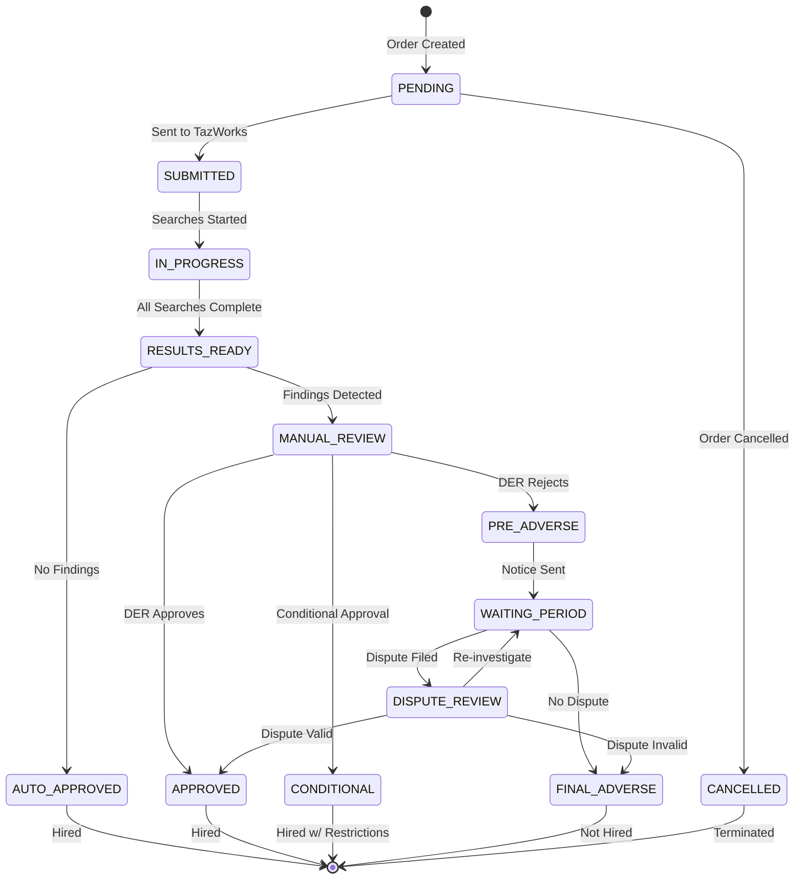

# Background Screening Module

**Version:** 1.0 | **Vendor:** TazWorks | **Compliance:** FCRA, EEOC

---

## 1. Overview

The Background Screening module manages pre-employment and continuous background checks including:
- Criminal history searches (county, state, federal)
- Employment verification
- Education verification
- Motor vehicle records
- Credit checks (where permitted)
- Adverse action workflow (FCRA compliant)

### Budget Allocation
- **Estimated LOC:** ~2,500 lines
- **Development Time:** 3-4 weeks
- **External API Costs:** $20-100 per screening package

---

## 2. Business Workflow

```
┌─────────────────────────────────────────────────────────────────────────────┐
│                    BACKGROUND CHECK LIFECYCLE                                │
├─────────────────────────────────────────────────────────────────────────────┤
│                                                                              │
│  1. INITIATION                                                               │
│  ├── Select screening package (Basic, Standard, Comprehensive)              │
│  ├── Collect candidate consent (e-signature)                                │
│  ├── Submit order to TazWorks API                                           │
│  └── Receive order confirmation                                             │
│                                                                              │
│  2. SEARCHES IN PROGRESS                                                     │
│  ├── Criminal searches (7-14 days typical)                                  │
│  ├── Employment verification (3-5 days)                                     │
│  ├── Education verification (3-5 days)                                      │
│  ├── MVR check (1-2 days)                                                   │
│  └── Real-time status updates via webhook                                   │
│                                                                              │
│  3. RESULTS READY                                                            │
│  ├── All searches complete                                                  │
│  ├── Parse results for findings                                             │
│  ├── Route based on findings:                                               │
│  │   ├── No findings → Auto-approve                                         │
│  │   └── Findings → Manual adjudication                                     │
│  └── Update Employee.complianceData                                         │
│                                                                              │
│  4. ADJUDICATION (if findings)                                              │
│  ├── DER reviews findings against policy                                    │
│  ├── Apply individualized assessment (EEOC)                                 │
│  ├── Decision options:                                                      │
│  │   ├── Approve (clear to hire)                                            │
│  │   ├── Conditional (restrictions apply)                                   │
│  │   └── Reject (proceed to adverse action)                                 │
│  └── Document decision rationale                                            │
│                                                                              │
│  5. ADVERSE ACTION (FCRA Compliance)                                        │
│  ├── Pre-Adverse Action Notice                                              │
│  │   ├── Send notice with copy of report                                    │
│  │   ├── Include "Summary of Rights"                                        │
│  │   └── 5 business day waiting period                                      │
│  ├── Waiting Period                                                         │
│  │   ├── Candidate may dispute                                              │
│  │   └── Re-investigate if dispute filed                                    │
│  └── Final Adverse Action Notice                                            │
│      ├── Send final denial                                                  │
│      └── Include appeal rights                                              │
│                                                                              │
└─────────────────────────────────────────────────────────────────────────────┘
```

---

## 3. State Machine



---

## 4. API Specification

### Endpoints

| Endpoint | Method | Permission | Description |
|:---------|:-------|:-----------|:------------|
| `/api/background/screenings` | GET | `background:read` | List screenings |
| `/api/background/screenings` | POST | `background:write` | Create screening order |
| `/api/background/screenings/[id]` | GET | `background:read` | Get single screening |
| `/api/background/screenings/[id]` | PATCH | `background:write` | Update screening |
| `/api/background/adjudication` | GET | `background:read` | Adjudication queue |
| `/api/background/adjudication` | POST | `background:write` | Submit adjudication |
| `/api/background/adverse-action` | GET | `background:read` | Adverse action queue |
| `/api/background/adverse-action` | POST | `background:write` | Initiate adverse action |

### Request/Response Schemas

```typescript
// POST /api/background/screenings
interface CreateScreeningRequest {
  employeeId: string
  packageType: 'BASIC' | 'STANDARD' | 'COMPREHENSIVE' | 'EXECUTIVE'
  screeningTypes: ScreeningType[]
  consentDocumentId: string // S3 URL to signed consent
}

type ScreeningType =
  | 'CRIMINAL_COUNTY'
  | 'CRIMINAL_STATE'
  | 'CRIMINAL_FEDERAL'
  | 'SSN_TRACE'
  | 'EMPLOYMENT_VERIFICATION'
  | 'EDUCATION_VERIFICATION'
  | 'PROFESSIONAL_LICENSE'
  | 'MVR'
  | 'CREDIT_CHECK'
  | 'DRUG_SCREEN'

// GET /api/background/screenings
interface ScreeningResponse {
  id: string
  employeeId: string
  employee: {
    firstName: string
    lastName: string
    email: string
  }
  orderDate: string
  completionDate: string | null
  status: BackgroundCheckStatus
  screeningTypes: ScreeningType[]
  overallResult: 'CLEAR' | 'FINDINGS' | 'PENDING'
  findings: Finding[]
  adjudicationStatus: AdjudicationStatus | null
  adjudicationDate: string | null
  adjudicationNotes: string | null
  vendorId: string
  vendorOrderId: string
  continuousMonitoring: boolean
  createdAt: string
  updatedAt: string
}

interface Finding {
  type: ScreeningType
  severity: 'LOW' | 'MEDIUM' | 'HIGH' | 'CRITICAL'
  description: string
  date?: string
  jurisdiction?: string
  disposition?: string
}

// POST /api/background/adjudication
interface AdjudicationRequest {
  screeningId: string
  decision: 'APPROVED' | 'CONDITIONAL' | 'DENIED'
  notes: string
  conditions?: string[] // For conditional approvals
  individualized_assessment: {
    nature_of_offense: string
    time_elapsed: string
    job_relatedness: string
    evidence_of_rehabilitation: string
  }
}

// POST /api/background/adverse-action
interface AdverseActionRequest {
  screeningId: string
  actionType: 'PRE_ADVERSE' | 'FINAL_ADVERSE'
  notificationMethod: 'EMAIL' | 'MAIL' | 'BOTH'
  notes?: string
}
```

---

## 5. Data Model

```typescript
model BackgroundCheck {
  id                   String                 @id @default(cuid())
  tenantId             String
  employeeId           String
  orderDate            DateTime
  completionDate       DateTime?
  status               BackgroundCheckStatus
  screeningTypes       String[]               // Array of screening types
  overallResult        String?
  findings             Json?                  // Array of findings
  adjudicationStatus   AdjudicationStatus?
  adjudicationDate     DateTime?
  adjudicationNotes    String?
  vendorId             String?
  vendorOrderId        String?
  continuousMonitoring Boolean                @default(false)
  createdAt            DateTime               @default(now())
  updatedAt            DateTime               @updatedAt

  employee             Employee               @relation(fields: [employeeId], references: [id])

  @@index([tenantId])
  @@index([employeeId])
  @@index([status])
  @@map("background_checks")
}

enum BackgroundCheckStatus {
  PENDING
  IN_PROGRESS
  COMPLETED
  CANCELLED
}

enum AdjudicationStatus {
  PENDING
  APPROVED
  DENIED
  CONDITIONAL
}
```

---

## 6. Integrations

### TazWorks API

```typescript
// Order screening
interface TazWorksOrderRequest {
  package_id: string
  subject: {
    first_name: string
    last_name: string
    ssn: string
    dob: string
    address: {
      street: string
      city: string
      state: string
      zip: string
    }
  }
  callback_url: string
}

// Webhook payload
interface TazWorksWebhookPayload {
  event: 'STATUS_UPDATE' | 'RESULTS_READY'
  order_id: string
  status: 'SUBMITTED' | 'IN_PROGRESS' | 'COMPLETE' | 'CANCELLED'
  results?: {
    overall: 'CLEAR' | 'CONSIDER' | 'FAIL'
    searches: Array<{
      type: string
      status: 'CLEAR' | 'RECORDS_FOUND'
      records?: Array<{
        offense: string
        date: string
        disposition: string
        jurisdiction: string
      }>
    }>
  }
  report_url?: string
  signature: string
}
```

---

## 7. RBAC Matrix

| Permission | super_admin | system_admin | der | safety_manager | compliance_officer | field_worker | auditor |
|:-----------|:-----------:|:------------:|:---:|:--------------:|:------------------:|:------------:|:-------:|
| `background:read` | ✓ | ✓ | ✓ | ✓ | ✓ | - | ✓ |
| `background:write` | ✓ | ✓ | ✓ | - | ✓ | - | - |
| `background:delete` | ✓ | ✓ | - | - | - | - | - |
| `background:export` | ✓ | ✓ | ✓ | - | ✓ | - | - |
| `background:own` | ✓ | ✓ | ✓ | ✓ | ✓ | ✓ | ✓ |

---

## 8. UI Pages

| Route | Component | Permissions |
|:------|:----------|:------------|
| `/compliance/background` | BackgroundDashboard | `background:read` |
| `/compliance/background/orders` | ScreeningList | `background:read` |
| `/compliance/background/orders/new` | NewScreeningForm | `background:write` |
| `/compliance/background/orders/[id]` | ScreeningDetail | `background:read` |
| `/compliance/background/adjudication` | AdjudicationQueue | `background:write` |
| `/compliance/background/adverse-action` | AdverseActionManager | `background:write` |

---

## 9. Current Implementation Status

| Feature | Status | Notes |
|:--------|:-------|:------|
| Screening CRUD | Mock | Replace with Prisma |
| TazWorks Order | Not Started | API client needed |
| Webhook Handler | Not Started | Handler structure ready |
| Adjudication UI | Mock | Functional UI, mock data |
| Adverse Action | Not Started | FCRA workflow needed |
| EEOC Assessment | Not Started | Form template ready |
