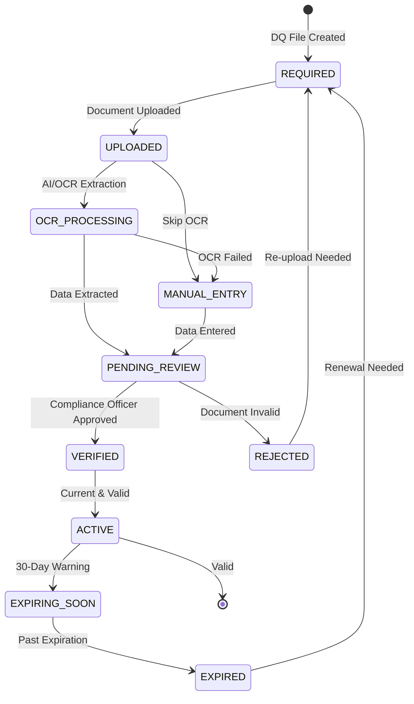

# DOT Compliance Module

**Version:** 1.0 | **Vendor:** FMCSA Clearinghouse | **Compliance:** 49 CFR Part 391

---

## 1. Overview

The DOT Compliance module manages driver qualification files and regulatory compliance including:
- Driver qualification (DQ) file management
- Medical certificate tracking
- Motor vehicle record (MVR) monitoring
- FMCSA Clearinghouse integration
- Hours of Service (HOS) tracking
- Annual reviews and certifications

### Budget Allocation
- **Estimated LOC:** ~3,500 lines
- **Development Time:** 5-6 weeks
- **External API Costs:** ~$2-5 per clearinghouse query

---

## 2. Business Workflow

```
┌─────────────────────────────────────────────────────────────────────────────┐
│                      DOT DRIVER QUALIFICATION LIFECYCLE                      │
├─────────────────────────────────────────────────────────────────────────────┤
│                                                                              │
│  1. DRIVER ONBOARDING                                                        │
│  ├── Collect driver application (DQ file initiation)                        │
│  ├── Verify CDL validity and endorsements                                   │
│  ├── Obtain medical certificate (med card)                                  │
│  ├── Conduct road test (or waiver)                                          │
│  ├── Query FMCSA Clearinghouse (pre-employment)                             │
│  └── Verify previous employer drug/alcohol history                          │
│                                                                              │
│  2. DQ FILE DOCUMENTS (Required)                                            │
│  ├── Driver Application                                                     │
│  ├── Motor Vehicle Record (MVR) - annual                                    │
│  ├── Road Test Certificate (or waiver)                                      │
│  ├── Medical Examiner's Certificate                                         │
│  ├── Previous Employer Verification (3 years)                               │
│  ├── Annual Review Certificate                                              │
│  └── Drug & Alcohol Testing Records                                         │
│                                                                              │
│  3. ONGOING COMPLIANCE                                                       │
│  ├── Medical certificate expiration monitoring                              │
│  │   ├── 90-day warning                                                     │
│  │   ├── 30-day warning                                                     │
│  │   └── Expired → Driver cannot operate                                    │
│  ├── Annual MVR checks                                                      │
│  ├── Annual clearinghouse queries                                           │
│  ├── Annual driver review/certification                                     │
│  └── Accident reporting (within 24 hours)                                   │
│                                                                              │
│  4. CLEARINGHOUSE QUERIES                                                    │
│  ├── Pre-employment (required)                                              │
│  ├── Annual (required)                                                      │
│  ├── Post-incident (if violation suspected)                                 │
│  └── Results:                                                               │
│      ├── No violations → Clear                                              │
│      └── Violations → Cannot operate until SAP completion                   │
│                                                                              │
│  5. VIOLATIONS & RESOLUTION                                                  │
│  ├── Violation reported to clearinghouse                                    │
│  ├── Driver referred to SAP                                                 │
│  ├── SAP evaluation & treatment plan                                        │
│  ├── Return-to-duty testing                                                 │
│  ├── Follow-up testing schedule                                             │
│  └── Clearinghouse violation resolved                                       │
│                                                                              │
└─────────────────────────────────────────────────────────────────────────────┘
```

---

## 3. State Machine - Document Lifecycle



---

## 4. API Specification

### Endpoints

| Endpoint | Method | Permission | Description |
|:---------|:-------|:-----------|:------------|
| `/api/dot/drivers` | GET | `dot:read` | List DOT-regulated drivers |
| `/api/dot/drivers` | POST | `dot:write` | Add driver to DOT roster |
| `/api/dot/drivers/[id]` | GET | `dot:read` | Get driver DQ file |
| `/api/dot/drivers/[id]` | PATCH | `dot:write` | Update driver record |
| `/api/dot/documents` | GET | `dot:read` | List DQ documents |
| `/api/dot/documents` | POST | `dot:write` | Upload document |
| `/api/dot/documents/[id]` | GET | `dot:read` | Get single document |
| `/api/dot/documents/[id]` | DELETE | `dot:delete` | Delete document |
| `/api/dot/clearinghouse` | GET | `dot:read` | Query history |
| `/api/dot/clearinghouse` | POST | `dot:write` | Submit query |

### Request/Response Schemas

```typescript
// GET /api/dot/drivers
interface DOTDriverResponse {
  id: string
  employeeId: string
  employee: {
    firstName: string
    lastName: string
    department: string
  }
  driverLicenseNumber: string
  driverLicenseState: string
  driverLicenseExpiry: string
  medicalCertExpiry: string
  medicalCertStatus: 'VALID' | 'EXPIRING' | 'EXPIRED'
  clearinghouseConsent: boolean
  clearinghouseLastQuery: string | null
  clearinghouseStatus: 'CLEAR' | 'VIOLATION' | 'PENDING'
  dqFileCompleteness: number // 0-100%
  documents: DOTDocumentSummary[]
  complianceStatus: 'GREEN' | 'YELLOW' | 'RED'
}

interface DOTDocumentSummary {
  type: DOTDocumentType
  status: 'REQUIRED' | 'UPLOADED' | 'VERIFIED' | 'EXPIRED'
  expiryDate?: string
  uploadedAt?: string
}

// POST /api/dot/documents
interface UploadDocumentRequest {
  driverRecordId: string
  documentType: DOTDocumentType
  file: File // Multipart form data
  expiryDate?: string
}

// POST /api/dot/clearinghouse
interface ClearinghouseQueryRequest {
  driverRecordId: string
  queryType: 'PRE_EMPLOYMENT' | 'ANNUAL' | 'FOLLOW_UP'
  driverConsent: boolean
  consentDocumentId: string
}

interface ClearinghouseQueryResponse {
  queryId: string
  status: 'SUBMITTED' | 'PENDING' | 'COMPLETE'
  result?: {
    status: 'CLEAR' | 'VIOLATIONS_FOUND'
    violations?: Array<{
      type: 'POSITIVE_TEST' | 'REFUSAL' | 'ACTUAL_KNOWLEDGE'
      date: string
      substance?: string
      reportingEmployer: string
      resolution?: {
        sapCompleted: boolean
        rtdPassed: boolean
        followUpComplete: boolean
      }
    }>
  }
}
```

---

## 5. Data Model

```typescript
model DOTRecord {
  id                     String        @id @default(cuid())
  tenantId               String
  employeeId             String
  driverLicenseNumber    String?
  driverLicenseState     String?
  driverLicenseExpiry    DateTime?
  medicalCertExpiry      DateTime?
  medicalCertStatus      String?       // VALID, EXPIRING, EXPIRED
  clearinghouseConsent   Boolean       @default(false)
  clearinghouseLastQuery DateTime?
  dqFileUrl              String?       // S3 URL to consolidated DQ file
  createdAt              DateTime      @default(now())
  updatedAt              DateTime      @updatedAt

  employee               Employee      @relation(fields: [employeeId], references: [id])
  documents              DOTDocument[]

  @@index([tenantId])
  @@index([employeeId])
  @@index([medicalCertExpiry])
  @@map("dot_records")
}

model DOTDocument {
  id                     String           @id @default(cuid())
  tenantId               String
  dotRecordId            String
  documentType           DOTDocumentType
  fileName               String
  fileUrl                String           // S3 signed URL
  uploadDate             DateTime         @default(now())
  expiryDate             DateTime?
  status                 String?          // REQUIRED, UPLOADED, VERIFIED, EXPIRED
  ocrData                Json?            // OCR extracted data
  createdAt              DateTime         @default(now())
  updatedAt              DateTime         @updatedAt

  dotRecord              DOTRecord        @relation(fields: [dotRecordId], references: [id])

  @@index([dotRecordId])
  @@index([documentType])
  @@map("dot_documents")
}

enum DOTDocumentType {
  DRIVER_APPLICATION
  MOTOR_VEHICLE_RECORD
  ROAD_TEST
  MEDICAL_CERTIFICATE
  PREVIOUS_EMPLOYER_VERIFICATION
  ANNUAL_REVIEW
  CLEARINGHOUSE_QUERY
  VIOLATION_RECORD
}
```

---

## 6. Integrations

### FMCSA Clearinghouse API

```typescript
// Pre-employment query
async function queryClearinghouse(
  driver: DOTRecord,
  queryType: 'PRE_EMPLOYMENT' | 'ANNUAL' | 'FOLLOW_UP'
): Promise<ClearinghouseQueryResponse> {
  const response = await fetch(`${FMCSA_API_BASE}/queries`, {
    method: 'POST',
    headers: {
      'Authorization': `Bearer ${process.env.FMCSA_API_TOKEN}`,
      'Content-Type': 'application/json'
    },
    body: JSON.stringify({
      driver_license_number: driver.driverLicenseNumber,
      driver_license_state: driver.driverLicenseState,
      query_type: queryType,
      employer_usdot: process.env.EMPLOYER_USDOT_NUMBER
    })
  })

  return response.json()
}

// Report violation
async function reportViolation(
  driver: DOTRecord,
  violation: {
    type: 'POSITIVE_TEST' | 'REFUSAL' | 'ACTUAL_KNOWLEDGE'
    date: string
    substance?: string
  }
): Promise<void> {
  await fetch(`${FMCSA_API_BASE}/violations`, {
    method: 'POST',
    headers: {
      'Authorization': `Bearer ${process.env.FMCSA_API_TOKEN}`,
      'Content-Type': 'application/json'
    },
    body: JSON.stringify({
      driver_license_number: driver.driverLicenseNumber,
      driver_license_state: driver.driverLicenseState,
      violation_type: violation.type,
      violation_date: violation.date,
      substance: violation.substance,
      employer_usdot: process.env.EMPLOYER_USDOT_NUMBER
    })
  })
}
```

### AWS Textract OCR

```typescript
// Process uploaded document with OCR
async function extractDocumentData(
  s3Key: string,
  documentType: DOTDocumentType
): Promise<Record<string, string>> {
  const textract = new TextractClient({ region: 'us-east-1' })

  const response = await textract.send(new AnalyzeDocumentCommand({
    Document: {
      S3Object: {
        Bucket: process.env.S3_DOCUMENTS_BUCKET,
        Name: s3Key
      }
    },
    FeatureTypes: ['FORMS', 'TABLES']
  }))

  // Extract fields based on document type
  const extractedData: Record<string, string> = {}

  for (const block of response.Blocks || []) {
    if (block.BlockType === 'KEY_VALUE_SET' && block.EntityTypes?.includes('KEY')) {
      const key = getBlockText(block, response.Blocks!)
      const value = getValueForKey(block, response.Blocks!)
      extractedData[key] = value
    }
  }

  return extractedData
}
```

---

## 7. RBAC Matrix

| Permission | super_admin | system_admin | der | safety_manager | compliance_officer | field_worker | auditor |
|:-----------|:-----------:|:------------:|:---:|:--------------:|:------------------:|:------------:|:-------:|
| `dot:read` | ✓ | ✓ | ✓ | ✓ | ✓ | - | ✓ |
| `dot:write` | ✓ | ✓ | ✓ | - | ✓ | - | - |
| `dot:delete` | ✓ | ✓ | - | - | - | - | - |
| `dot:export` | ✓ | ✓ | ✓ | - | ✓ | - | ✓ |
| `dot:own` | ✓ | ✓ | ✓ | ✓ | ✓ | ✓ | ✓ |

---

## 8. UI Pages

| Route | Component | Permissions |
|:------|:----------|:------------|
| `/compliance/dot` | DOTDashboard | `dot:read` |
| `/compliance/dot/drivers` | DriverRoster | `dot:read` |
| `/compliance/dot/drivers/[id]` | DQFileViewer | `dot:read` |
| `/compliance/dot/documents` | DocumentManager | `dot:read` |
| `/compliance/dot/clearinghouse` | ClearinghousePanel | `dot:read` |
| `/compliance/dot/expirations` | ExpirationCalendar | `dot:read` |

---

## 9. Current Implementation Status

| Feature | Status | Notes |
|:--------|:-------|:------|
| Driver Roster | Mock | Replace with Prisma |
| DQ File Viewer | Mock | Functional UI, mock data |
| Document Upload | Mock | S3 integration needed |
| OCR Processing | Not Started | AWS Textract ready |
| Clearinghouse API | Not Started | API client needed |
| Expiration Alerts | Not Started | Cron job needed |
