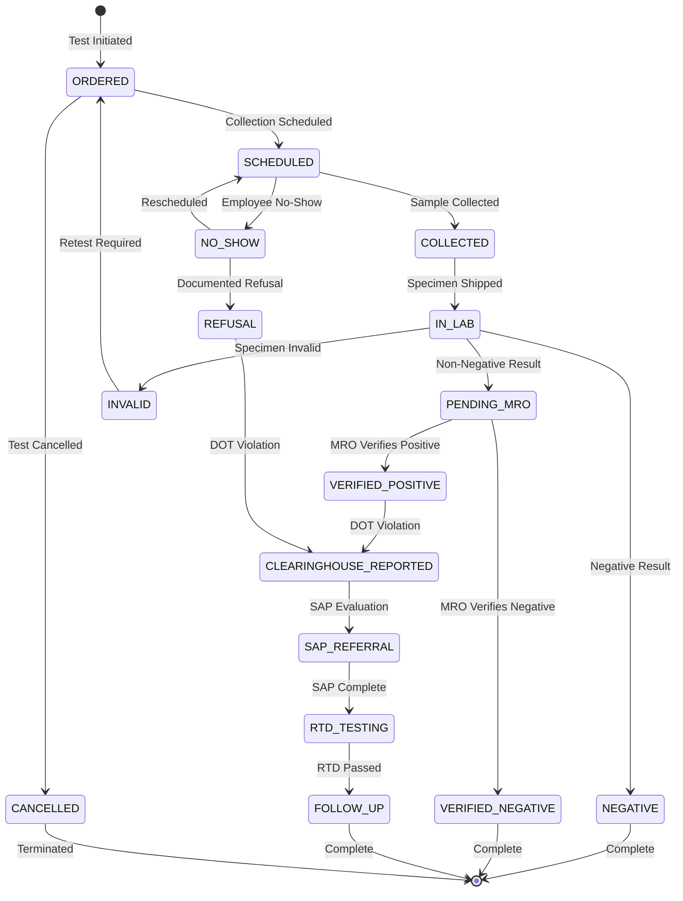

# Drug & Alcohol Testing Module

**Version:** 1.0 | **Vendor:** CRL, Quest, FormFox | **Compliance:** DOT 49 CFR Part 40

---

## 1. Overview

The Drug & Alcohol Testing module manages the complete lifecycle of workplace drug testing including:
- Random pool selection (DOT-compliant)
- Test scheduling and collection
- MRO (Medical Review Officer) review workflow
- FMCSA Clearinghouse reporting
- Chain of custody tracking

### Budget Allocation
- **Estimated LOC:** ~3,000 lines
- **Development Time:** 4-6 weeks
- **External API Costs:** ~$0.50-2.00 per test

---

## 2. Business Workflow

```
┌─────────────────────────────────────────────────────────────────────────────┐
│                      DRUG TEST LIFECYCLE                                     │
├─────────────────────────────────────────────────────────────────────────────┤
│                                                                              │
│  1. INITIATION                                                               │
│  ├── Random Selection (DOT quarterly pool) ───────────────┐                 │
│  ├── Pre-Employment (new hire)                            │                 │
│  ├── Post-Accident (within 32 hours)                      │                 │
│  ├── Reasonable Suspicion (documented by supervisor)      │                 │
│  └── Return-to-Duty / Follow-Up (after violation)         │                 │
│                                                           │                 │
│  2. COLLECTION                                            │                 │
│  ├── Generate donor notification                          │                 │
│  ├── Schedule collection site appointment                 │                 │
│  ├── Employee presents with photo ID                      │                 │
│  └── Specimen collected per DOT protocol                  │                 │
│                                                           │                 │
│  3. LAB ANALYSIS                                          │                 │
│  ├── Specimen shipped to certified lab                    │                 │
│  ├── Initial immunoassay screen                           │                 │
│  ├── GC/MS confirmation (if positive)                     │                 │
│  └── Results transmitted via ECCF format                  │                 │
│                                                           │                 │
│  4. MRO REVIEW                                            │                 │
│  ├── MRO receives positive/dilute results                 │                 │
│  ├── Contact donor for medical explanation                │                 │
│  ├── Verify prescriptions (if applicable)                 │                 │
│  └── Issue final determination                            │                 │
│                                                           │                 │
│  5. REPORTING                                             │                 │
│  ├── Update Employee.complianceData                       │                 │
│  ├── Report to FMCSA Clearinghouse (DOT violations)       │                 │
│  ├── Generate compliance alerts                           │                 │
│  └── Update dashboard metrics                             │                 │
│                                                           │                 │
└─────────────────────────────────────────────────────────────────────────────┘
```

---

## 3. State Machine



---

## 4. API Specification

### Endpoints

| Endpoint | Method | Permission | Description |
|:---------|:-------|:-----------|:------------|
| `/api/drug-testing/tests` | GET | `drug-testing:read` | List tests with filters |
| `/api/drug-testing/tests` | POST | `drug-testing:write` | Create new test |
| `/api/drug-testing/tests/[id]` | GET | `drug-testing:read` | Get single test |
| `/api/drug-testing/tests/[id]` | PATCH | `drug-testing:write` | Update test |
| `/api/drug-testing/tests/[id]` | DELETE | `drug-testing:delete` | Delete test |
| `/api/drug-testing/mro-review` | GET | `drug-testing:read` | MRO review queue |
| `/api/drug-testing/mro-review` | POST | `drug-testing:write` | Submit MRO review |
| `/api/drug-testing/random-selection` | POST | `drug-testing:write` | Run random selection |
| `/api/drug-testing/clearinghouse` | GET | `dot:read` | Query clearinghouse |
| `/api/drug-testing/clearinghouse` | POST | `dot:write` | Report to clearinghouse |

### Request/Response Schemas

```typescript
// POST /api/drug-testing/tests
interface CreateDrugTestRequest {
  employeeId: string
  testType: DrugTestType
  scheduledDate?: string // ISO date
  collectionSiteId?: string
  notes?: string
}

// GET /api/drug-testing/tests
interface DrugTestResponse {
  id: string
  employeeId: string
  employee: {
    firstName: string
    lastName: string
    department: string
  }
  testType: DrugTestType
  testDate: string
  collectionSite?: string
  donorId?: string
  specimenId?: string
  result: TestResult | null
  mroReviewStatus: MROStatus | null
  mroReviewDate?: string
  mroNotes?: string
  vendorId?: string
  vendorTestId?: string
  clearinghouseReported: boolean
  createdAt: string
  updatedAt: string
}

// POST /api/drug-testing/mro-review
interface MROReviewRequest {
  testId: string
  determination: 'VERIFIED_NEGATIVE' | 'VERIFIED_POSITIVE' | 'TEST_CANCELLED'
  notes: string
  contactedDonor: boolean
  legitimateMedicalExplanation?: boolean
}

// POST /api/drug-testing/random-selection
interface RandomSelectionRequest {
  poolId: string
  selectionPercentage: number // 25%, 50%, etc.
  effectiveDate: string
  auditSeed?: number // For reproducibility
}

interface RandomSelectionResponse {
  selectionId: string
  poolSize: number
  selectedCount: number
  selectedEmployees: Array<{
    employeeId: string
    firstName: string
    lastName: string
    department: string
  }>
  seed: number // Store for audit
  timestamp: string
}
```

---

## 5. Data Model

```typescript
// Prisma schema excerpt
model DrugTest {
  id                    String       @id @default(cuid())
  tenantId              String
  employeeId            String
  testType              DrugTestType
  testDate              DateTime
  collectionSite        String?
  donorId               String?      // CCF form ID
  specimenId            String?      // Lab specimen ID
  result                TestResult?
  mroReviewStatus       MROStatus?
  mroReviewDate         DateTime?
  mroNotes              String?
  vendorId              String?      // CRL, Quest
  vendorTestId          String?
  clearinghouseReported Boolean      @default(false)
  createdAt             DateTime     @default(now())
  updatedAt             DateTime     @updatedAt

  employee              Employee     @relation(fields: [employeeId], references: [id])

  @@index([tenantId])
  @@index([employeeId])
  @@index([testDate])
  @@index([result])
  @@map("drug_tests")
}

enum DrugTestType {
  PRE_EMPLOYMENT
  RANDOM
  POST_ACCIDENT
  REASONABLE_SUSPICION
  RETURN_TO_DUTY
  FOLLOW_UP
}

enum TestResult {
  NEGATIVE
  POSITIVE
  DILUTE
  INVALID
  CANCELLED
  PENDING
}

enum MROStatus {
  PENDING_REVIEW
  VERIFIED_NEGATIVE
  VERIFIED_POSITIVE
  TEST_CANCELLED
}
```

### Employee.complianceData JSONB Structure

```typescript
interface DrugTestingComplianceData {
  drugTest: {
    status: 'green' | 'yellow' | 'red'
    lastTestDate: string | null
    lastResult: TestResult | null
    nextDueDate: string | null // For random pool
    pendingReview: boolean
    clearinghouseStatus: 'clear' | 'violation' | 'unknown'
    totalTests: number
  }
}
```

---

## 6. Integrations

### CRL Labs Webhook

```typescript
// Incoming webhook payload (ECCF format)
interface CRLWebhookPayload {
  event_type: 'RESULT_READY'
  ccf_number: string
  specimen_id: string
  donor_ssn_last4: string
  collection_date: string
  result: 'NEGATIVE' | 'POSITIVE' | 'DILUTE_NEGATIVE' | 'DILUTE_POSITIVE'
  substances?: Array<{
    name: string
    cutoff: string
    level: string
  }>
  pdf_url: string // Signed URL to result PDF
  signature: string // HMAC signature for verification
}

// Webhook handler
export async function handleCRLWebhook(payload: CRLWebhookPayload) {
  // 1. Verify signature
  const isValid = verifyCRLSignature(payload, process.env.CRL_WEBHOOK_SECRET)
  if (!isValid) throw new Error('Invalid webhook signature')

  // 2. Find matching test by CCF number
  const test = await prisma.drugTest.findFirst({
    where: { donorId: payload.ccf_number }
  })
  if (!test) throw new Error('Test not found')

  // 3. Update test with result
  await prisma.drugTest.update({
    where: { id: test.id },
    data: {
      result: mapCRLResult(payload.result),
      mroReviewStatus: payload.result.includes('POSITIVE') ? 'PENDING_REVIEW' : null,
      vendorTestId: payload.specimen_id
    }
  })

  // 4. Update employee compliance data
  await updateEmployeeComplianceData(test.employeeId, 'drugTest', {
    lastTestDate: payload.collection_date,
    lastResult: mapCRLResult(payload.result),
    pendingReview: payload.result.includes('POSITIVE')
  })

  // 5. Generate alert if non-negative
  if (payload.result !== 'NEGATIVE') {
    await createAlert({
      type: 'DRUG_TEST_NON_NEGATIVE',
      employeeId: test.employeeId,
      message: `Drug test result: ${payload.result}`,
      priority: 'HIGH'
    })
  }
}
```

### FMCSA Clearinghouse API

```typescript
// Query clearinghouse for driver
interface ClearinghouseQueryRequest {
  driverLicenseNumber: string
  driverLicenseState: string
  queryReason: 'PRE_EMPLOYMENT' | 'ANNUAL' | 'FOLLOW_UP'
}

interface ClearinghouseQueryResponse {
  queryId: string
  status: 'CLEAR' | 'VIOLATIONS_FOUND' | 'PENDING'
  violations?: Array<{
    type: 'POSITIVE_TEST' | 'REFUSAL' | 'ACTUAL_KNOWLEDGE'
    date: string
    reportingEmployer: string
  }>
}

// Report violation to clearinghouse
interface ClearinghouseReportRequest {
  driverLicenseNumber: string
  driverLicenseState: string
  violationType: 'POSITIVE_TEST' | 'REFUSAL'
  violationDate: string
  testType: DrugTestType
  substances?: string[]
}
```

---

## 7. RBAC Matrix

| Permission | super_admin | system_admin | der | safety_manager | compliance_officer | field_worker | auditor |
|:-----------|:-----------:|:------------:|:---:|:--------------:|:------------------:|:------------:|:-------:|
| `drug-testing:read` | ✓ | ✓ | ✓ | ✓ | ✓ | - | ✓ |
| `drug-testing:write` | ✓ | ✓ | ✓ | ✓ | ✓ | - | - |
| `drug-testing:delete` | ✓ | ✓ | - | - | - | - | - |
| `drug-testing:export` | ✓ | ✓ | ✓ | ✓ | ✓ | - | ✓ |
| `drug-testing:own` | ✓ | ✓ | ✓ | ✓ | ✓ | ✓ | ✓ |

---

## 8. UI Pages

| Route | Component | Permissions |
|:------|:----------|:------------|
| `/compliance/drug-testing` | DrugTestingDashboard | `drug-testing:read` |
| `/compliance/drug-testing/tests` | DrugTestList | `drug-testing:read` |
| `/compliance/drug-testing/tests/[id]` | DrugTestDetail | `drug-testing:read` |
| `/compliance/drug-testing/mro-review` | MROReviewQueue | `drug-testing:write` |
| `/compliance/drug-testing/random-pool` | RandomPoolManager | `drug-testing:write` |
| `/compliance/drug-testing/clearinghouse` | ClearinghousePanel | `dot:read` |

---

## 9. Current Implementation Status

| Feature | Status | Notes |
|:--------|:-------|:------|
| Test CRUD | Mock | Replace with Prisma |
| MRO Review UI | Mock | Functional UI, mock data |
| Random Selection | Not Started | Algorithm ready, no backend |
| CRL Webhook | Not Started | Handler structure ready |
| Clearinghouse | Not Started | API client needed |
| Export (PDF/CSV) | Mock | jsPDF ready, no real data |
