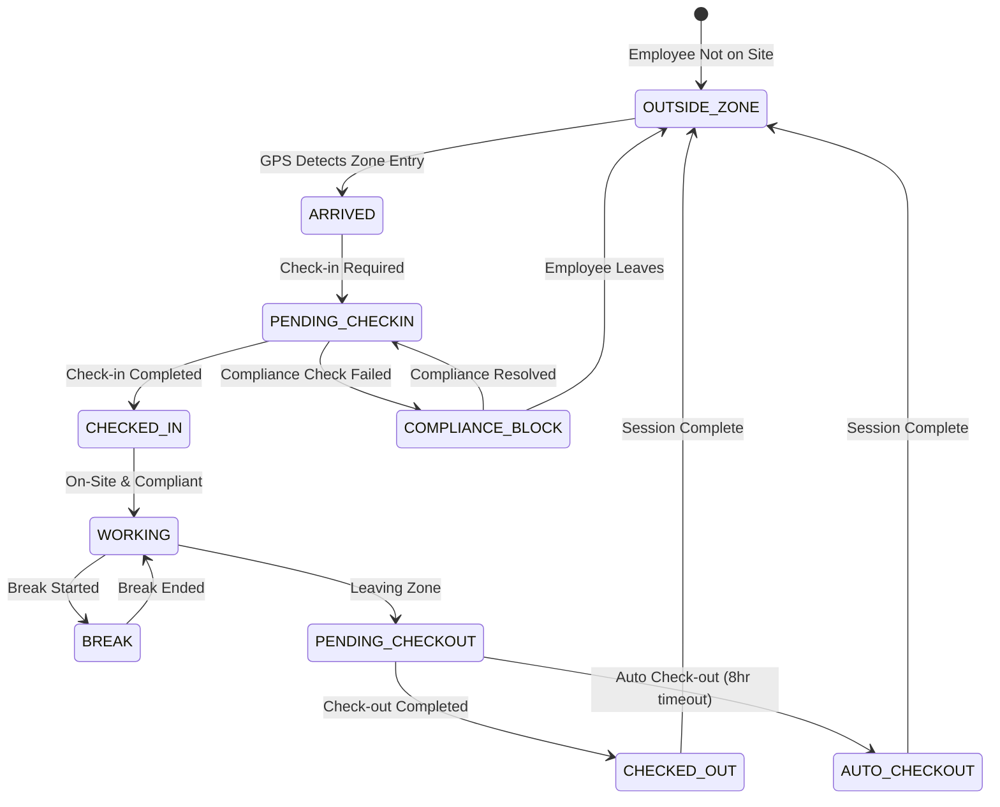

# Geo-Fencing Module

**Version:** 1.0 | **Vendor:** PostGIS/Mapbox | **Compliance:** OSHA Site Safety

---

## 1. Overview

The Geo-Fencing module manages location-based compliance and employee check-ins including:
- Geographic zone management (job sites, restricted areas)
- Employee check-in/check-out tracking
- Location-based compliance triggers
- Site-specific safety requirements
- Attendance and time tracking

### Budget Allocation
- **Estimated LOC:** ~1,500 lines
- **Development Time:** 2-3 weeks
- **External API Costs:** ~$0.50-1.00 per 1K API calls (Mapbox)

---

## 2. Business Workflow

```
┌─────────────────────────────────────────────────────────────────────────────┐
│                      GEO-FENCING LIFECYCLE                                   │
├─────────────────────────────────────────────────────────────────────────────┤
│                                                                              │
│  1. ZONE CONFIGURATION                                                       │
│  ├── Define geographic boundaries (polygon, radius)                         │
│  ├── Set zone type (STATE, COUNTY, CITY, SITE)                              │
│  ├── Configure compliance requirements per zone                             │
│  └── Link training/certification requirements                               │
│                                                                              │
│  2. EMPLOYEE CHECK-IN                                                        │
│  ├── Employee arrives at job site                                           │
│  ├── Opens PCS Pass app                                                     │
│  ├── Check-in method:                                                       │
│  │   ├── GPS (automatic location detection)                                 │
│  │   ├── QR Code (site-specific code scan)                                  │
│  │   └── Manual (supervisor override)                                       │
│  └── System validates location within zone boundary                         │
│                                                                              │
│  3. COMPLIANCE VERIFICATION                                                  │
│  ├── Check employee's current compliance status                             │
│  ├── Verify zone-specific requirements met                                  │
│  │   ├── Valid certifications for site work                                 │
│  │   ├── Up-to-date drug test (if required)                                 │
│  │   └── Background check status (if required)                              │
│  └── Allow/deny site access based on compliance                             │
│                                                                              │
│  4. TRIGGERS & ALERTS                                                        │
│  ├── Non-compliant employee attempts check-in                               │
│  │   └── Alert to supervisor + compliance officer                           │
│  ├── Employee in zone without check-in                                      │
│  │   └── Alert for unauthorized presence                                    │
│  ├── Check-out without check-in                                             │
│  │   └── Data quality alert                                                 │
│  └── Zone-specific training due                                             │
│      └── Reminder before site assignment                                    │
│                                                                              │
│  5. REPORTING & ANALYTICS                                                    │
│  ├── Site attendance by day/week/month                                      │
│  ├── Time on site per employee                                              │
│  ├── Compliance exceptions by zone                                          │
│  └── Geographic distribution of workforce                                   │
│                                                                              │
└─────────────────────────────────────────────────────────────────────────────┘
```

---

## 3. State Machine



---

## 4. API Specification

### Endpoints

| Endpoint | Method | Permission | Description |
|:---------|:-------|:-----------|:------------|
| `/api/geo-fencing/zones` | GET | `geo-fencing:read` | List zones |
| `/api/geo-fencing/zones` | POST | `geo-fencing:write` | Create zone |
| `/api/geo-fencing/zones/[id]` | GET | `geo-fencing:read` | Get zone |
| `/api/geo-fencing/zones/[id]` | PATCH | `geo-fencing:write` | Update zone |
| `/api/geo-fencing/zones/[id]` | DELETE | `geo-fencing:delete` | Delete zone |
| `/api/geo-fencing/check-in` | POST | `employees:own` | Employee check-in |
| `/api/geo-fencing/check-out` | POST | `employees:own` | Employee check-out |
| `/api/geo-fencing/check-ins` | GET | `geo-fencing:read` | Check-in history |
| `/api/geo-fencing/triggers` | GET | `geo-fencing:read` | List triggers |
| `/api/geo-fencing/triggers` | POST | `geo-fencing:write` | Create trigger |

### Request/Response Schemas

```typescript
// POST /api/geo-fencing/zones
interface CreateZoneRequest {
  name: string
  type: ZoneType
  coordinates: GeoJSON.Polygon | GeoJSON.Point
  radius?: number // For point-based zones (meters)
  complianceRequirements: {
    requiredCertificates?: string[]
    requireDrugTest?: boolean
    requireBackgroundCheck?: boolean
    additionalRules?: string[]
  }
}

// GET /api/geo-fencing/zones
interface ZoneResponse {
  id: string
  tenantId: string
  name: string
  type: ZoneType
  coordinates: GeoJSON.Geometry
  radius?: number
  complianceRequirements: {
    requiredCertificates: string[]
    requireDrugTest: boolean
    requireBackgroundCheck: boolean
  }
  activeCheckIns: number
  createdAt: string
}

// POST /api/geo-fencing/check-in
interface CheckInRequest {
  zoneId?: string // If known
  latitude: number
  longitude: number
  method: CheckInMethod
  accuracy?: number // GPS accuracy in meters
}

interface CheckInResponse {
  success: boolean
  checkInId: string
  zone: {
    id: string
    name: string
  }
  complianceStatus: {
    compliant: boolean
    issues?: Array<{
      type: string
      message: string
    }>
  }
  checkInTime: string
}

// GET /api/geo-fencing/check-ins
interface CheckInHistoryResponse {
  checkIns: Array<{
    id: string
    employeeId: string
    employee: {
      firstName: string
      lastName: string
    }
    zoneId: string
    zone: {
      name: string
    }
    checkInTime: string
    checkOutTime: string | null
    duration: number | null // minutes
    method: CheckInMethod
    latitude: number
    longitude: number
  }>
  pagination: {
    page: number
    pageSize: number
    total: number
  }
}
```

---

## 5. Data Model

```typescript
model GeoFenceZone {
  id                     String    @id @default(cuid())
  tenantId               String
  name                   String
  type                   ZoneType
  coordinates            Json      // GeoJSON for PostGIS
  radius                 Float?    // For point-based zones (meters)
  complianceRequirements Json      // { requiredCertificates, requireDrugTest, etc. }
  createdAt              DateTime  @default(now())
  updatedAt              DateTime  @updatedAt

  checkIns               CheckIn[]

  @@index([tenantId])
  @@map("geo_fence_zones")
}

model CheckIn {
  id                     String        @id @default(cuid())
  tenantId               String
  employeeId             String
  zoneId                 String
  checkInTime            DateTime      @default(now())
  checkOutTime           DateTime?
  latitude               Float
  longitude              Float
  method                 CheckInMethod
  accuracy               Float?        // GPS accuracy in meters
  createdAt              DateTime      @default(now())

  zone                   GeoFenceZone  @relation(fields: [zoneId], references: [id])

  @@index([tenantId])
  @@index([employeeId])
  @@index([zoneId])
  @@index([checkInTime])
  @@map("check_ins")
}

enum ZoneType {
  STATE
  COUNTY
  CITY
  SITE
}

enum CheckInMethod {
  GPS
  QR_CODE
  MANUAL
}
```

---

## 6. PostGIS Integration

```sql
-- Enable PostGIS extension
CREATE EXTENSION IF NOT EXISTS postgis;

-- Add geometry column to zones table
ALTER TABLE geo_fence_zones
ADD COLUMN geom geometry(Polygon, 4326);

-- Create spatial index
CREATE INDEX idx_zones_geom ON geo_fence_zones USING GIST (geom);

-- Function to check if point is within any zone
CREATE OR REPLACE FUNCTION find_zone_for_point(
  p_tenant_id TEXT,
  p_lat FLOAT,
  p_lon FLOAT
)
RETURNS TABLE (zone_id TEXT, zone_name TEXT) AS $$
BEGIN
  RETURN QUERY
  SELECT id, name
  FROM geo_fence_zones
  WHERE tenant_id = p_tenant_id
    AND ST_Contains(geom, ST_SetSRID(ST_MakePoint(p_lon, p_lat), 4326));
END;
$$ LANGUAGE plpgsql;

-- Check if employee is within radius of point-based zone
CREATE OR REPLACE FUNCTION is_within_zone_radius(
  p_zone_id TEXT,
  p_lat FLOAT,
  p_lon FLOAT
)
RETURNS BOOLEAN AS $$
DECLARE
  v_zone geo_fence_zones%ROWTYPE;
  v_distance FLOAT;
BEGIN
  SELECT * INTO v_zone FROM geo_fence_zones WHERE id = p_zone_id;

  IF v_zone.radius IS NULL THEN
    RETURN ST_Contains(v_zone.geom, ST_SetSRID(ST_MakePoint(p_lon, p_lat), 4326));
  ELSE
    v_distance := ST_Distance(
      ST_SetSRID(ST_MakePoint(p_lon, p_lat), 4326)::geography,
      (SELECT coordinates->>'coordinates' FROM geo_fence_zones WHERE id = p_zone_id)::geography
    );
    RETURN v_distance <= v_zone.radius;
  END IF;
END;
$$ LANGUAGE plpgsql;
```

---

## 7. RBAC Matrix

| Permission | super_admin | system_admin | der | safety_manager | compliance_officer | field_worker | auditor |
|:-----------|:-----------:|:------------:|:---:|:--------------:|:------------------:|:------------:|:-------:|
| `geo-fencing:read` | ✓ | ✓ | ✓ | ✓ | ✓ | ✓* | ✓ |
| `geo-fencing:write` | ✓ | ✓ | ✓ | - | - | - | - |
| `employees:own` (check-in) | - | - | - | - | - | ✓ | - |

*Field workers can only see zones they're checked into

---

## 8. UI Pages

| Route | Component | Permissions |
|:------|:----------|:------------|
| `/geo-fencing` | GeoFencingDashboard | `geo-fencing:read` |
| `/geo-fencing/map` | ZoneMapView | `geo-fencing:read` |
| `/geo-fencing/zones` | ZoneManager | `geo-fencing:read` |
| `/geo-fencing/check-ins` | CheckInHistory | `geo-fencing:read` |
| `/geo-fencing/triggers` | TriggerManager | `geo-fencing:write` |
| `/portals/pcs-pass/check-in` | MobileCheckIn | `employees:own` |

---

## 9. Current Implementation Status

| Feature | Status | Notes |
|:--------|:-------|:------|
| Zone CRUD | Mock | Replace with Prisma + PostGIS |
| Map View | Mock | Uses `GeoFenceMapNoAPI` placeholder |
| Check-in API | Mock | Mobile integration needed |
| PostGIS Setup | Not Started | SQL scripts ready |
| Compliance Triggers | Not Started | Business logic needed |
| QR Code Generation | Not Started | Library ready |
