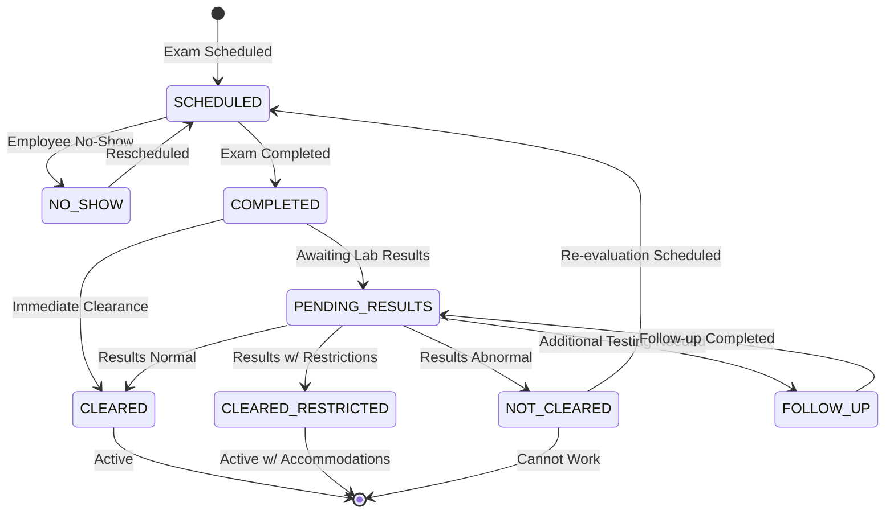

# Occupational Health Module

**Version:** 1.0 | **Vendor:** Quest Diagnostics | **Compliance:** OSHA, HIPAA

---

## 1. Overview

The Occupational Health module manages workplace health surveillance and medical records including:
- Physical examinations
- Hearing conservation (audiometric testing)
- Respirator fit testing
- Immunization tracking
- OSHA 300 injury/illness logging
- Fit-for-duty determinations

### Budget Allocation
- **Estimated LOC:** ~2,000 lines
- **Development Time:** 3-4 weeks
- **External API Costs:** $50-200 per physical exam

---

## 2. Business Workflow

```
┌─────────────────────────────────────────────────────────────────────────────┐
│                    OCCUPATIONAL HEALTH LIFECYCLE                             │
├─────────────────────────────────────────────────────────────────────────────┤
│                                                                              │
│  1. MEDICAL SURVEILLANCE                                                     │
│  ├── Pre-employment physical (based on job requirements)                    │
│  ├── Annual physicals (if required by job function)                         │
│  ├── Hearing tests (per OSHA 1910.95)                                       │
│  ├── Respirator fit tests (per OSHA 1910.134)                               │
│  └── Immunizations (Hep B, Tetanus, etc.)                                   │
│                                                                              │
│  2. SCHEDULING & TRACKING                                                    │
│  ├── Identify employees due for testing                                     │
│  ├── Schedule clinic appointments                                           │
│  ├── Send reminders (email/SMS)                                             │
│  └── Track completion rates                                                 │
│                                                                              │
│  3. RESULTS MANAGEMENT                                                       │
│  ├── Receive results from clinic/vendor                                     │
│  ├── Parse results for clearance status                                     │
│  ├── Update Employee.complianceData                                         │
│  └── Flag any restrictions/accommodations                                   │
│                                                                              │
│  4. FIT-FOR-DUTY                                                            │
│  ├── Clear (no restrictions)                                                │
│  ├── Clear with restrictions (accommodations needed)                        │
│  ├── Not cleared (cannot perform job duties)                                │
│  └── Pending follow-up (additional testing needed)                          │
│                                                                              │
│  5. OSHA 300 LOGGING                                                        │
│  ├── Record workplace injuries/illnesses                                    │
│  ├── Track days away, restricted duty, job transfer                         │
│  ├── Annual summary (Form 300A)                                             │
│  └── Retain records per OSHA requirements                                   │
│                                                                              │
└─────────────────────────────────────────────────────────────────────────────┘
```

---

## 3. State Machine



---

## 4. API Specification

### Endpoints

| Endpoint | Method | Permission | Description |
|:---------|:-------|:-----------|:------------|
| `/api/health/records` | GET | `health:read` | List health records |
| `/api/health/records` | POST | `health:write` | Create health record |
| `/api/health/records/[id]` | GET | `health:read` | Get single record |
| `/api/health/records/[id]` | PATCH | `health:write` | Update record |
| `/api/health/surveillance` | GET | `health:read` | Surveillance dashboard |
| `/api/health/osha-300` | GET | `health:read` | OSHA 300 log |
| `/api/health/osha-300` | POST | `health:write` | Add OSHA 300 entry |

### Request/Response Schemas

```typescript
// GET /api/health/records
interface HealthRecordResponse {
  id: string
  employeeId: string
  employee: {
    firstName: string
    lastName: string
    department: string
    jobTitle: string
  }
  recordType: HealthRecordType
  recordDate: string
  provider: string
  result: 'CLEARED' | 'CLEARED_RESTRICTED' | 'NOT_CLEARED' | 'PENDING'
  restrictions?: string[]
  accommodations?: string
  expiryDate: string | null
  vendorId?: string
  vendorRecordId?: string
  createdAt: string
}

// POST /api/health/records
interface CreateHealthRecordRequest {
  employeeId: string
  recordType: HealthRecordType
  recordDate: string
  provider: string
  result: string
  restrictions?: string[]
  accommodations?: string
  expiryDate?: string
  documentUrl?: string
}

// POST /api/health/osha-300
interface OSHA300EntryRequest {
  employeeId: string
  caseNumber: string
  incidentDate: string
  location: string
  description: string
  injuryType: InjuryType
  bodyPart: string
  outcome: 'DEATH' | 'DAYS_AWAY' | 'RESTRICTED' | 'JOB_TRANSFER' | 'OTHER'
  daysAway?: number
  daysRestricted?: number
}

type InjuryType =
  | 'INJURY'
  | 'SKIN_DISORDER'
  | 'RESPIRATORY'
  | 'POISONING'
  | 'HEARING_LOSS'
  | 'OTHER_ILLNESS'
```

---

## 5. Data Model

```typescript
model HealthRecord {
  id                 String           @id @default(cuid())
  tenantId           String
  employeeId         String
  recordType         HealthRecordType
  recordDate         DateTime
  provider           String?
  result             String?          // CLEARED, CLEARED_RESTRICTED, NOT_CLEARED, PENDING
  restrictions       Json?            // Array of restrictions
  workAccommodations String?
  expiryDate         DateTime?
  vendorId           String?
  vendorRecordId     String?
  documentUrl        String?          // S3 URL
  createdAt          DateTime         @default(now())
  updatedAt          DateTime         @updatedAt

  employee           Employee         @relation(fields: [employeeId], references: [id])

  @@index([tenantId])
  @@index([employeeId])
  @@index([recordType])
  @@index([expiryDate])
  @@map("health_records")
}

enum HealthRecordType {
  PHYSICAL_EXAM
  HEARING_TEST
  RESPIRATOR_FIT_TEST
  IMMUNIZATION
  DRUG_SCREEN
  INJURY_REPORT
}
```

---

## 6. RBAC Matrix

| Permission | super_admin | system_admin | der | safety_manager | compliance_officer | field_worker | auditor |
|:-----------|:-----------:|:------------:|:---:|:--------------:|:------------------:|:------------:|:-------:|
| `health:read` | ✓ | ✓ | ✓ | ✓ | ✓ | - | ✓ |
| `health:write` | ✓ | ✓ | ✓ | ✓ | - | - | - |
| `health:delete` | ✓ | ✓ | - | - | - | - | - |
| `health:export` | ✓ | ✓ | ✓ | ✓ | - | - | ✓ |
| `health:own` | ✓ | ✓ | ✓ | ✓ | ✓ | ✓ | ✓ |

---

## 7. UI Pages

| Route | Component | Permissions |
|:------|:----------|:------------|
| `/compliance/health` | HealthDashboard | `health:read` |
| `/compliance/health/records` | HealthRecordList | `health:read` |
| `/compliance/health/surveillance` | SurveillanceMatrix | `health:read` |
| `/compliance/health/osha-300` | OSHA300Log | `health:read` |
| `/compliance/health/scheduling` | HealthScheduler | `health:write` |

---

## 8. Current Implementation Status

| Feature | Status | Notes |
|:--------|:-------|:------|
| Health Records CRUD | Mock | Replace with Prisma |
| Surveillance Matrix | Mock | Functional UI |
| OSHA 300 Log | Mock | Form ready |
| Clinic Integration | Not Started | Quest API needed |
| Expiration Alerts | Not Started | Cron job needed |
