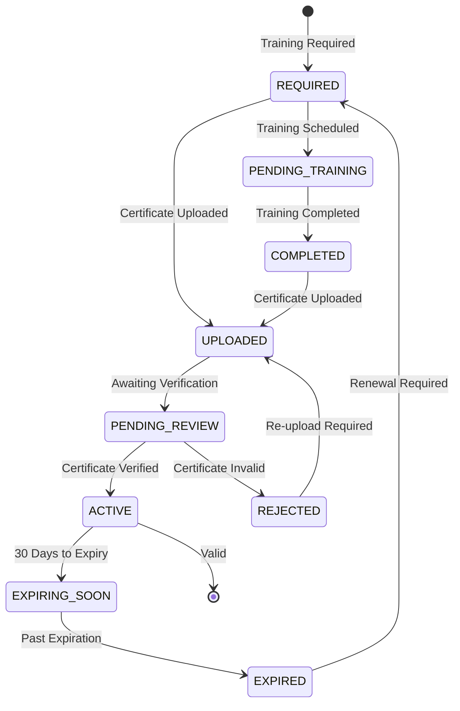

# Training & Certifications Module

**Version:** 1.0 | **Vendor:** Internal/LMS | **Compliance:** OSHA, DOT, Industry-specific

---

## 1. Overview

The Training & Certifications module manages employee training requirements and credential tracking including:
- Certificate management (upload, verify, track expiration)
- Training matrix (role-based requirements)
- Automated expiration alerts
- LMS integration
- Compliance reporting

### Budget Allocation
- **Estimated LOC:** ~1,800 lines
- **Development Time:** 2-3 weeks
- **External API Costs:** Minimal (primarily internal)

---

## 2. Business Workflow

```
┌─────────────────────────────────────────────────────────────────────────────┐
│                  TRAINING & CERTIFICATION LIFECYCLE                          │
├─────────────────────────────────────────────────────────────────────────────┤
│                                                                              │
│  1. REQUIREMENTS DEFINITION                                                  │
│  ├── Define training matrix by job role                                     │
│  ├── Set renewal frequencies (annual, bi-annual, etc.)                      │
│  ├── Configure grace periods                                                │
│  └── Link to compliance requirements (OSHA, DOT, etc.)                      │
│                                                                              │
│  2. CERTIFICATE MANAGEMENT                                                   │
│  ├── Employee uploads certificate                                           │
│  ├── OCR extracts key data (issuer, date, expiry)                           │
│  ├── Compliance officer verifies                                            │
│  └── Status updated (ACTIVE)                                                │
│                                                                              │
│  3. EXPIRATION MONITORING                                                    │
│  ├── Daily job checks expiration dates                                      │
│  ├── 90-day warning → Status: EXPIRING_SOON                                 │
│  ├── 60-day warning → Email notification                                    │
│  ├── 30-day warning → SMS + email + manager alert                           │
│  └── Expired → Status: EXPIRED, flag non-compliant                          │
│                                                                              │
│  4. RENEWAL WORKFLOW                                                        │
│  ├── Employee notified of upcoming expiration                               │
│  ├── Complete renewal training (LMS or external)                            │
│  ├── Upload new certificate                                                 │
│  └── Certificate verified, status reset to ACTIVE                           │
│                                                                              │
│  5. COMPLIANCE REPORTING                                                    │
│  ├── Training completion rates by department                                │
│  ├── Expiration forecast (30/60/90 day)                                     │
│  ├── Non-compliant employee list                                            │
│  └── Audit-ready certificate repository                                     │
│                                                                              │
└─────────────────────────────────────────────────────────────────────────────┘
```

---

## 3. State Machine



---

## 4. API Specification

### Endpoints

| Endpoint | Method | Permission | Description |
|:---------|:-------|:-----------|:------------|
| `/api/training/certificates` | GET | `training:read` | List certificates |
| `/api/training/certificates` | POST | `training:write` | Upload certificate |
| `/api/training/certificates/[id]` | GET | `training:read` | Get single certificate |
| `/api/training/certificates/[id]` | PATCH | `training:write` | Update certificate |
| `/api/training/certificates/[id]` | DELETE | `training:delete` | Delete certificate |
| `/api/training/matrix` | GET | `training:read` | Get training matrix |
| `/api/training/matrix` | POST | `training:write` | Update training matrix |
| `/api/training/expirations` | GET | `training:read` | Expiration report |

### Request/Response Schemas

```typescript
// GET /api/training/certificates
interface CertificateResponse {
  id: string
  employeeId: string
  employee: {
    firstName: string
    lastName: string
    department: string
    jobTitle: string
  }
  certificateType: string
  certificateNumber: string | null
  issueDate: string
  expiryDate: string | null
  issuingAuthority: string | null
  status: CertificateStatus
  fileUrl: string | null
  ocrData: Record<string, string> | null
  createdAt: string
}

// POST /api/training/certificates
interface CreateCertificateRequest {
  employeeId: string
  certificateType: string
  certificateNumber?: string
  issueDate: string
  expiryDate?: string
  issuingAuthority?: string
  file?: File // Multipart form data
}

// GET /api/training/matrix
interface TrainingMatrixResponse {
  jobRoles: Array<{
    role: string
    department: string
    requiredCertificates: Array<{
      type: string
      renewalFrequency: 'ANNUAL' | 'BIANNUAL' | 'ONCE' | 'AS_NEEDED'
      mandatory: boolean
      gracePeriodDays: number
    }>
  }>
}

// GET /api/training/expirations
interface ExpirationReportResponse {
  expired: number
  expiring30Days: number
  expiring60Days: number
  expiring90Days: number
  employees: Array<{
    employeeId: string
    firstName: string
    lastName: string
    department: string
    certificates: Array<{
      type: string
      expiryDate: string
      daysUntilExpiry: number
      status: CertificateStatus
    }>
  }>
}
```

---

## 5. Data Model

```typescript
model TrainingRecord {
  id                 String            @id @default(cuid())
  tenantId           String
  employeeId         String
  certificateType    String            // e.g., "OSHA 10", "Forklift", "First Aid"
  certificateNumber  String?
  issueDate          DateTime
  expiryDate         DateTime?
  issuingAuthority   String?           // e.g., "OSHA", "Red Cross", "State of Texas"
  fileUrl            String?           // S3 URL
  ocrData            Json?             // OCR extracted data
  status             CertificateStatus
  createdAt          DateTime          @default(now())
  updatedAt          DateTime          @updatedAt

  employee           Employee          @relation(fields: [employeeId], references: [id])

  @@index([tenantId])
  @@index([employeeId])
  @@index([certificateType])
  @@index([expiryDate])
  @@index([status])
  @@map("training_records")
}

enum CertificateStatus {
  ACTIVE
  EXPIRED
  EXPIRING_SOON
  REVOKED
}
```

---

## 6. Common Certificate Types

| Certificate | Issuing Authority | Renewal | Notes |
|:------------|:------------------|:--------|:------|
| OSHA 10-Hour | OSHA | Once | Construction/General Industry |
| OSHA 30-Hour | OSHA | Once | Supervisors |
| First Aid/CPR | Red Cross/AHA | 2 years | |
| Forklift Operator | Employer | 3 years | |
| CDL | State DMV | 4-8 years | |
| DOT Medical Card | Medical Examiner | 1-2 years | |
| H2S Awareness | SafeLand/IADC | Annual | Oil & Gas |
| PEC SafeLand | PEC | 2 years | Oil & Gas |
| Confined Space | Employer | Annual | |
| Fall Protection | Employer | Annual | |

---

## 7. RBAC Matrix

| Permission | super_admin | system_admin | der | safety_manager | compliance_officer | field_worker | auditor |
|:-----------|:-----------:|:------------:|:---:|:--------------:|:------------------:|:------------:|:-------:|
| `training:read` | ✓ | ✓ | ✓ | ✓ | ✓ | - | ✓ |
| `training:write` | ✓ | ✓ | ✓ | ✓ | - | - | - |
| `training:delete` | ✓ | ✓ | - | - | - | - | - |
| `training:export` | ✓ | ✓ | ✓ | ✓ | - | - | ✓ |
| `training:own` | ✓ | ✓ | ✓ | ✓ | ✓ | ✓ | ✓ |

---

## 8. UI Pages

| Route | Component | Permissions |
|:------|:----------|:------------|
| `/compliance/training` | TrainingDashboard | `training:read` |
| `/compliance/training/certificates` | CertificateList | `training:read` |
| `/compliance/training/matrix` | TrainingMatrix | `training:read` |
| `/compliance/training/expirations` | ExpirationCalendar | `training:read` |
| `/compliance/training/upload` | CertificateUpload | `training:write` |

---

## 9. Current Implementation Status

| Feature | Status | Notes |
|:--------|:-------|:------|
| Certificate CRUD | Mock | Replace with Prisma |
| Training Matrix | Mock | Configuration needed |
| OCR Processing | Not Started | AWS Textract ready |
| Expiration Alerts | Not Started | Cron job needed |
| LMS Integration | Not Started | Optional |
